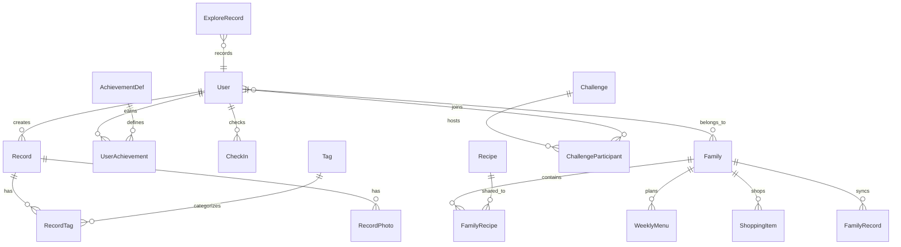

# 味记 MVP 开发速查手册

> **用途：** 替代完整 API 设计 / 数据库设计 / 架构设计文档，供 MVP 阶段快速启动开发  
> **日期：** 2026-06-24  
> **框架：** weiji-server（Koa + @koa/router + 装饰器简化方案）+ weiji-ai（Python FastAPI）+ weiji-admin-web（Vue3）  
> **说明：** 本手册最初基于 cool-admin (Midway.js) 方案草拟，**该方案未采用**。实际后端为 Koa + 装饰器简化方案（装饰器 API 兼容 Midway 风格，但不引入完整 DI 容器；`bootstrap.ts` 装配中间件并扫描 `@Controller` 路由）。文中保留的 cool-admin / Redis / BullMQ / WebSocket / 腾讯云 COS / 微信小程序 / Flutter 等内容为原目标设计，**均未实现**，仅作历史参考。

---

## 目录

- [一、接口约定卡片](#一接口约定卡片)
- [二、核心实体关系图](#二核心实体关系图)
- [三、模块边界图](#三模块边界图)
- [四、环境搭建指南](#四环境搭建指南)
- [五、MVP 任务拆分](#五mvp-任务拆分)

---

# 一、接口约定卡片

> **原则：** 标准 CRUD 接口由 weiji-server 控制器（@Controller + @Get/@Post 装饰器）实现，统一走 `{ code, data, message }` 响应契约。  
> **本文档只列需要手动约定的非标准接口。**

---

## 1.1 拍照 → AI 识别 → 保存

> 新架构（cool-admin）将旧 `/api/record/analyze` 拆为三步：`POST /app/ai/recognize`（识别）→ `POST /app/ai/beautify`（美化）→ `POST /app/record`（保存记录）。下文规格以识别端点为例。

```
POST /app/ai/recognize
Content-Type: multipart/form-data
Authorization: Bearer {token}
```

**请求：**

| 字段 | 类型 | 必填 | 说明 |
|------|------|------|------|
| image | File | 是 | 美食照片，JPG/PNG/HEIC，≤20MB，客户端压缩至 ≤2MB |
| source | string | 否 | "camera" / "gallery"，默认 "camera" |

**响应（成功 200）：**

```json
{
  "code": 0,
  "data": {
    "recordId": "uuid",
    "dishName": "红烧牛肉面",
    "ingredients": [
      { "name": "牛肉", "confidence": 0.95 },
      { "name": "面条", "confidence": 0.92 },
      { "name": "青菜", "confidence": 0.88 }
    ],
    "cookingMethod": "炖",
    "confidence": 0.93,
    "nutrition": {
      "calories": 520,
      "protein": 28.5,
      "fat": 18.2,
      "carbs": 62.0
    },
    "imageUrl": "https://cos.xxx.com/records/xxx.jpg",
    "beautifiedUrl": "https://cos.xxx.com/records/xxx_beautified.jpg"
  }
}
```

**响应（识别失败，仍需手动输入 200）：**

```json
{
  "code": 0,
  "data": {
    "recordId": "uuid",
    "dishName": "",
    "ingredients": [],
    "confidence": 0.35,
    "needManualInput": true,
    "imageUrl": "https://cos.xxx.com/records/xxx.jpg"
  }
}
```

**错误：**

| code | 说明 |
|------|------|
| 1001 | 图片格式不支持 |
| 1002 | 图片大小超过限制 |
| 1003 | AI 服务暂时不可用，请稍后重试 |
| 1004 | 图片内容审核不通过 |

**处理逻辑：**

```
后端收到图片 → 腾讯云COS数据万象审核
  ├─ 审核不通过 → 返回1004
  └─ 审核通过
      ├─ 上传COS → 获得URL
      ├─ 异步调用火山引擎美化 → 获得美化URL
      ├─ 调用百度AI菜品识别
      │   ├─ confidence ≥ 0.8 → 直接返回结果
      │   └─ confidence < 0.8 → 调用 GPT-4o Vision 兜底
      │       ├─ 兜底成功 → 返回结果
      │       └─ 兜底失败 → 返回 needManualInput=true
      └─ 返回结果给客户端
```

---

## 1.2 菜谱推荐（LLM + RAG，流式响应）

```
POST /app/ai/recommend
Content-Type: application/json
Authorization: Bearer {token}
```

**请求：**

```json
{
  "query": "今天想吃点酸辣口味的",
  "dishName": "酸辣粉",
  "ingredients": ["粉条", "辣椒", "醋"],
  "healthProfile": {
    "diabetes": false,
    "hypertension": true,
    "calorieLimit": 600
  },
  "count": 5,
  "stream": true
}
```

**响应（SSE 流式）：**

```
Content-Type: text/event-stream

event: token
data: {"text": "推荐"}

event: token
data: {"text": "您"}

event: token
data: {"text": "尝试"}

event: token
data: {"text": "酸汤肥牛"}

event: done
data: {"recipes": [{"name": "酸汤肥牛", "difficulty": "中等", "time": 30, "matchScore": 0.92, ...}]}
```

**错误：**

| code | 说明 |
|------|------|
| 2001 | LLM 服务暂时不可用 |
| 2002 | 未找到匹配的菜谱 |

---

## 1.3 WebSocket 实时同步协议

```
连接地址：wss://api.weiji.com/ws
认证：连接后首个消息发送 JWT token
```

### 事件定义

| 事件名 | 方向 | 载荷 | 说明 |
|--------|------|------|------|
| `auth` | Client→Server | `{ "token": "xxx" }` | 认证 |
| `join:family` | Client→Server | `{ "familyId": "xxx" }` | 加入家庭组房间 |
| `leave:family` | Client→Server | `{ "familyId": "xxx" }` | 离开家庭组房间 |
| `auth:ok` | Server→Client | `{ "userId": "xxx" }` | 认证成功 |
| `auth:fail` | Server→Client | `{ "reason": "token expired" }` | 认证失败 |
| `list:update` | Server→Client | `{ "familyId": "xxx", "item": {...}, "action": "add/update/delete/check" }` | 购物清单变更 |
| `menu:update` | Server→Client | `{ "familyId": "xxx", "menu": {...}, "action": "update/vote" }` | 菜单变更 |
| `checkin:new` | Server→Client | `{ "familyId": "xxx", "userId": "xxx", "record": {...} }` | 成员新打卡 |
| `ping` | Client→Server | `{}` | 心跳（每30秒） |
| `pong` | Server→Client | `{}` | 心跳响应 |

### 购物清单同步消息格式

```json
{
  "event": "list:update",
  "data": {
    "familyId": "uuid",
    "item": {
      "id": "uuid",
      "name": "牛肉",
      "category": "肉类",
      "quantity": "500g",
      "checked": false,
      "checkedBy": null,
      "updatedAt": "2026-06-24T10:30:00Z"
    },
    "action": "check"
  }
}
```

### 离线重连策略

```
客户端维护本地操作队列（SQLite）：
  在线时 → WebSocket 实时同步
  断线时 → 操作写入本地队列
  重连后 → 回放队列（每条操作携带 clientTimestamp）
  冲突解决 → LWW（Last-Write-Wins），服务端以 updatedAt 为准
```

---

## 1.4 语音识别代理

```
POST /app/ai/voice/recognize
Content-Type: multipart/form-data
Authorization: Bearer {token}
```

**请求：**

| 字段 | 类型 | 必填 | 说明 |
|------|------|------|------|
| audio | File | 是 | 语音文件，WAV/MP3/AMR，≤30秒，≤5MB |
| mode | string | 否 | "standard" / "elderly"（老年模式启用方言识别），默认 "standard" |

**响应：**

```json
{
  "code": 0,
  "data": {
    "text": "今天吃什么菜",
    "intent": "recipe_query",
    "response": {
      "type": "recipe_list",
      "recipes": [...]
    }
  }
}
```

**错误：**

| code | 说明 |
|------|------|
| 3001 | 语音识别失败，请重试 |
| 3002 | 音频格式不支持 |
| 3003 | 未检测到有效语音 |

---

## 1.5 标准 CRUD 接口命名规范

> 以下命名规范供 weiji-server 控制器实现参考（实际已实现端点见根 README「核心业务能力」表）。
> 当前架构（cool-admin-midway）端点按 `/open/*`（公开）/ `/app/*`（C 端）/ `/admin/*`（B 端 cl-crud）三段划分，下表为 C 端 `/app/*` 前缀。

| 模块 | 端点前缀 | 典型接口 |
|------|----------|----------|
| 账户 | `/app/account` | login / register（account 模块，weiji_app_user） |
| 用户 | `/app/user` | profile / 个人档案 |
| 饮食记录 | `/app/record` | CRUD + 按日期/标签/评分筛选 |
| 评分标记 | `/app/record/{id}/rate` | PATCH（更新评分和标签） |
| 菜谱 | `/app/family/recipe` | 家庭空间菜谱 CRUD + 按菜系/难度/食材搜索 |
| 家庭组 | `/app/family` | CRUD + 邀请/移除成员 + 成员列表 |
| 协作菜单 | `/app/family/menu` | 周菜单 CRUD + 投票 |
| 购物清单 | `/app/family/shopping` | 购物清单 CRUD + 勾选 |
| 成就 | `/app/achievement` | 成就定义 + 用户成就记录 |
| 打卡 | `/app/checkin` | 打卡记录 + 连续天数查询 |
| 挑战赛 | `/app/challenge` | 挑战赛定义 + 参与记录 + 排行榜 |
| 玩法 | `/app/gamification` | 图鉴 / 人格 / 盲猜 |
| AI 代理 | `/app/ai` | recognize / beautify / recommend / voice / sticker（转发 :17802） |

**统一规范：**

- 分页：`?page=1&pageSize=20`，响应体含 `total`、`list`、`page`、`pageSize`
- 排序：`?sort=createdAt&order=desc`
- 筛选：`?tag=家的味道&rating=4`
- 时间范围：`?startDate=2026-06-01&endDate=2026-06-30`
- 统一响应：成功 `{ "code": 1000, "message": "success", "data": <payload> }`；失败 `{ "code": <非1000>, "message": "人类可读消息", "data": null }`
- B 端管理 CRUD 由 cl-crud 在 `/admin/*` 自动生成（record/family/recipe/achievement 等）

---

# 二、核心实体关系图

## 2.1 ER 图



## 2.2 核心表字段清单

> 以下为味记核心业务表的设计字段清单（设计参考）。**实际建表脚本**见 `weiji-server/db/init.sql`，共 12 张表（users / families / family_members / family_recipes / invitations / records / weekly_menu / shopping_items / achievements / user_achievements / check_ins / challenges）；下文部分表（如 record_photo / tag / recipe_version / explore_record 等）为设计扩展，尚未落库。

### record（饮食记录表）— 核心表

| 字段 | 类型 | 必填 | 说明 |
|------|------|------|------|
| id | uuid | 是 | PK |
| userId | uuid | 是 | FK → user.id |
| dishName | varchar(100) | 是 | 菜品名称 |
| cookingMethod | varchar(20) | 否 | 炒/蒸/煮/烤/炸/炖/凉拌/其他 |
| rating | tinyint | 是 | 1-5，默认3 |
| note | varchar(500) | 否 | 备注 |
| aiConfidence | decimal(3,2) | 否 | AI识别置信度 |
| nutritionJson | json | 否 | 营养分析结果 JSON |
| mealType | varchar(20) | 否 | 早餐/午餐/晚餐/加餐/夜宵 |
| recordDate | date | 是 | 记录日期（非创建日期） |
| source | varchar(20) | 是 | camera/gallery/manual |
| isDeleted | tinyint | 是 | 软删除，默认0 |
| createdAt | datetime | 是 | |
| updatedAt | datetime | 是 | |

**索引：** `idx_user_date` (userId, recordDate)，`idx_date` (recordDate)，`idx_rating` (rating)

### record_photo（记录照片表）

| 字段 | 类型 | 必填 | 说明 |
|------|------|------|------|
| id | uuid | 是 | PK |
| recordId | uuid | 是 | FK → record.id |
| originalUrl | varchar(500) | 是 | 原图 COS URL |
| beautifiedUrl | varchar(500) | 否 | 美化后 COS URL |
| stickerUrl | varchar(500) | 否 | AI贴纸 COS URL |
| sort | int | 是 | 排序，默认0 |

### record_tag（记录标签关联表）

| 字段 | 类型 | 必填 | 说明 |
|------|------|------|------|
| id | uuid | 是 | PK |
| recordId | uuid | 是 | FK → record.id |
| tagId | uuid | 是 | FK → tag.id |

### tag（标签表）

| 字段 | 类型 | 必填 | 说明 |
|------|------|------|------|
| id | uuid | 是 | PK |
| name | varchar(20) | 是 | 标签名 |
| type | varchar(20) | 是 | preset / custom |
| userId | uuid | 否 | 自定义标签所属用户 |
| sort | int | 是 | 排序 |

**预设标签数据：** 家的味道、值得复刻、踩雷、健康轻食、下饭神器、深夜食堂、周末大餐、快手菜

### family（家庭组表）

| 字段 | 类型 | 必填 | 说明 |
|------|------|------|------|
| id | uuid | 是 | PK |
| name | varchar(50) | 是 | 家庭组名称 |
| ownerId | uuid | 是 | FK → user.id，创建者即管理员 |
| memberCount | int | 是 | 成员数，最大6 |
| inviteCode | varchar(10) | 是 | 唯一邀请码 |
| isDeleted | tinyint | 是 | 默认0 |

### family_member（家庭成员表）

| 字段 | 类型 | 必填 | 说明 |
|------|------|------|------|
| id | uuid | 是 | PK |
| familyId | uuid | 是 | FK → family.id |
| userId | uuid | 是 | FK → user.id |
| role | varchar(20) | 是 | admin / member |
| joinedAt | datetime | 是 | |

**唯一索引：** `uq_family_user` (familyId, userId)

### family_recipe（家庭菜谱表）

| 字段 | 类型 | 必填 | 说明 |
|------|------|------|------|
| id | uuid | 是 | PK |
| familyId | uuid | 是 | FK → family.id |
| name | varchar(100) | 是 | 菜谱名称 |
| category | varchar(30) | 是 | 家常菜/面食/烘焙/汤羹/自定义 |
| ingredients | json | 是 | [{name, amount, unit}] |
| steps | json | 是 | [{stepNum, text, imageUrl}] |
| coverUrl | varchar(500) | 否 | 封面图 |
| difficulty | varchar(10) | 否 | 简单/中等/困难 |
| cookTime | int | 否 | 烹饪时间（分钟） |
| uploaderId | uuid | 是 | FK → user.id |
| versionCount | int | 是 | 版本迭代次数，默认1 |
| isDeleted | tinyint | 是 | 默认0 |

### recipe_version（菜谱版本迭代表）

| 字段 | 类型 | 必填 | 说明 |
|------|------|------|------|
| id | uuid | 是 | PK |
| recipeId | uuid | 是 | FK → family_recipe.id |
| version | int | 是 | 版本号 |
| diff | varchar(500) | 是 | 变更说明（"这次盐少放了半勺"） |
| editorId | uuid | 是 | FK → user.id |
| createdAt | datetime | 是 | |

### weekly_menu（周菜单表）

| 字段 | 类型 | 必填 | 说明 |
|------|------|------|------|
| id | uuid | 是 | PK |
| familyId | uuid | 是 | FK → family.id |
| weekStart | date | 是 | 周一日期 |
| dayOfWeek | tinyint | 是 | 1-7 |
| mealType | varchar(10) | 是 | 早餐/午餐/晚餐 |
| recipeId | uuid | 否 | FK → family_recipe.id |
| recipeName | varchar(100) | 是 | 冗余菜名 |
| votes | json | 否 | {userId: voteType} |

### shopping_item（购物清单表）

| 字段 | 类型 | 必填 | 说明 |
|------|------|------|------|
| id | uuid | 是 | PK |
| familyId | uuid | 是 | FK → family.id |
| name | varchar(50) | 是 | 物品名称 |
| category | varchar(20) | 是 | 蔬菜/肉类/水产/调料/乳制品/干货/其他 |
| quantity | varchar(20) | 是 | "500g" / "2个" / "1瓶" |
| checked | tinyint | 是 | 默认0 |
| checkedBy | uuid | 否 | FK → user.id |
| checkedAt | datetime | 否 | |
| sort | int | 是 | 排序 |

### achievement_def（成就定义表 — 种子数据）

| 字段 | 类型 | 必填 | 说明 |
|------|------|------|------|
| id | uuid | 是 | PK |
| code | varchar(50) | 是 | 唯一标识 |
| name | varchar(50) | 是 | 成就名称 |
| description | varchar(200) | 是 | 成就描述 |
| icon | varchar(100) | 是 | 图标标识 |
| type | varchar(20) | 是 | record/streak/variety/family |
| condition | json | 是 | 触发条件 |
| expReward | int | 是 | 经验值奖励 |

**种子数据示例：**

| code | name | condition | exp |
|------|------|-----------|-----|
| first_record | 美食初体验 | { "recordCount": 1 } | 50 |
| streak_7 | 一周全勤 | { "streakDays": 7 } | 200 |
| streak_30 | 月度达人 | { "streakDays": 30 } | 500 |
| record_100 | 百道美食家 | { "recordCount": 100 } | 1000 |
| cuisine_10 | 菜系探险家 | { "cuisineCount": 10 } | 500 |
| family_create | 家的味道 | { "familyCreated": true } | 100 |

### user_achievement（用户成就记录表）

| 字段 | 类型 | 必填 | 说明 |
|------|------|------|------|
| id | uuid | 是 | PK |
| userId | uuid | 是 | FK → user.id |
| achievementId | uuid | 是 | FK → achievement_def.id |
| earnedAt | datetime | 是 | |

### check_in（打卡记录表）

| 字段 | 类型 | 必填 | 说明 |
|------|------|------|------|
| id | uuid | 是 | PK |
| userId | uuid | 是 | FK → user.id |
| checkDate | date | 是 | 打卡日期 |
| recordCount | int | 是 | 当天记录数 |
| isReplenish | tinyint | 是 | 是否补签，默认0 |

**唯一索引：** `uq_user_date` (userId, checkDate)

### challenge（挑战赛表）

| 字段 | 类型 | 必填 | 说明 |
|------|------|------|------|
| id | uuid | 是 | PK |
| title | varchar(100) | 是 | 挑战名称 |
| description | varchar(500) | 是 | 挑战描述 |
| rules | json | 是 | 挑战规则 |
| startDate | date | 是 | |
| endDate | date | 是 | |
| badgeCode | varchar(50) | 是 | 完成奖励徽章码 |
| isActive | tinyint | 是 | 默认1 |

### challenge_participant（挑战赛参与表）

| 字段 | 类型 | 必填 | 说明 |
|------|------|------|------|
| id | uuid | 是 | PK |
| challengeId | uuid | 是 | FK → challenge.id |
| userId | uuid | 是 | FK → user.id |
| progress | json | 是 | 进度数据 |
| completed | tinyint | 是 | 默认0 |
| completedAt | datetime | 否 | |

### explore_record（探店记录表）

| 字段 | 类型 | 必填 | 说明 |
|------|------|------|------|
| id | uuid | 是 | PK |
| userId | uuid | 是 | FK → user.id |
| restaurantName | varchar(100) | 是 | |
| address | varchar(300) | 否 | |
| latitude | decimal(10,7) | 否 | |
| longitude | decimal(10,7) | 否 | |
| dishes | json | 是 | [{name, rating, note}] |
| overallRating | tinyint | 是 | 1-5 |
| visitDate | date | 是 | |
| photos | json | 否 | [url1, url2] |

---

# 三、模块边界图

> **已落地：** 本节为 2026-06 草拟的 cool-admin 目标架构设计，**已按此方向落地**为 cool-admin 全家桶（见根 README）：weiji-admin-web（cool-admin-vue :17901）+ weiji-app（cool-uni :17900 H5）→ weiji-server（cool-admin-midway，Midway.js + TypeORM + MySQL + Redis，:17801）→ weiji-ai（FastAPI :17802）。下文图与流程中的 Socket.io / BullMQ / Redis PubSub / 腾讯云 COS / Flutter 客户端等**均未实现**，保留仅作目标设计参考。

## 3.1 架构总览

```
┌─────────────────────────────────────────────────────────────────┐
│                        客户端层                                  │
│                                                                  │
│  ┌──────────────────┐         ┌──────────────────┐              │
│  │ 微信小程序        │         │ iOS/Android App   │             │
│  │ uni-app (Vue3)   │         │ Flutter           │             │
│  └────────┬─────────┘         └────────┬─────────┘              │
│           │                            │                         │
│           └──────────┬─────────────────┘                        │
│                      │ HTTPS / WSS                               │
└──────────────────────┼──────────────────────────────────────────┘
                       │
┌──────────────────────┼──────────────────────────────────────────┐
│            cool-admin (Midway.js) 业务层                         │
│                      │                                           │
│  ┌───────────────────┼───────────────────────────────────┐      │
│  │               API Gateway (Gin 风格)                    │      │
│  │  · JWT 认证  · 限流  · 参数校验  · 日志                │      │
│  └───────────────────┼───────────────────────────────────┘      │
│                      │                                           │
│  ┌──────┐ ┌──────┐ ┌──────┐ ┌──────┐ ┌──────┐ ┌──────┐       │
│  │ 用户 │ │ 记录 │ │ 家庭 │ │ 成就 │ │ 推荐 │ │ 语音 │       │
│  │ 模块 │ │ 模块 │ │ 模块 │ │ 模块 │ │ 模块 │ │ 模块 │       │
│  │(内置)│ │      │ │      │ │      │ │      │ │      │       │
│  └──┬───┘ └──┬───┘ └──┬───┘ └──┬───┘ └──┬───┘ └──┬───┘       │
│     │        │        │        │        │        │              │
│     │        │  ┌─────┘        │        │        │              │
│     │        │  │              │        │        │              │
│  ┌──┴────────┴──┴──────────────┴────────┴────────┴──┐         │
│  │                   共享服务层                         │         │
│  │  · Socket.io (实时同步)  · BullMQ (任务队列)        │         │
│  │  · Redis (缓存/限流/PubSub)  · COS (文件存储)       │         │
│  └────────────────────────────────────────────────────┘         │
│                                                                  │
│  ┌──────────────────────────────────────────────────────┐       │
│  │                    数据层                              │       │
│  │  MySQL (PostgreSQL)  ·  Redis  ·  腾讯云COS            │       │
│  └──────────────────────────────────────────────────────┘       │
└──────────────────────────────────────────────────────────────────┘
                       │
                       │ HTTP (内部网络)
                       ▼
┌──────────────────────────────────────────────────────────────────┐
│                  Python (FastAPI) AI 服务层                        │
│                                                                   │
│  ┌──────────┐ ┌──────────┐ ┌──────────┐ ┌──────────┐           │
│  │ 食物识别 │ │ 图片美化 │ │ 菜谱推荐 │ │ 语音代理 │           │
│  │ 服务     │ │ 服务     │ │ 服务     │ │ 服务     │           │
│  └────┬─────┘ └────┬─────┘ └────┬─────┘ └────┬─────┘           │
│       │            │            │            │                    │
│       ▼            ▼            ▼            ▼                    │
│  ┌────────────────────────────────────────────────────────┐      │
│  │                   外部 AI 服务                           │      │
│  │  · 百度AI 菜品识别  · GPT-4o Vision (兜底)               │      │
│  │  · 火山引擎 智能美化  · 通义千问 Qwen3.5                 │      │
│  │  · 科大讯飞 ASR/TTS  · 腾讯云 内容审核                   │      │
│  └────────────────────────────────────────────────────────┘      │
└──────────────────────────────────────────────────────────────────┘
```

## 3.2 模块职责与通信方式

| 模块 | 职责 | 与其他模块通信 |
|------|------|---------------|
| **用户模块** | 注册/登录/微信授权/手机号验证/个人信息 | cool-admin 内置，开箱即用 |
| **记录模块** | 拍照记录 CRUD、AI识别回调、评分标记、照片管理、日记查询 | → AI 服务（HTTP 同步）→ 成就模块（BullMQ 事件） |
| **家庭模块** | 家庭组 CRUD、成员管理、共享菜谱、协作菜单、购物清单、饮食报告 | → 用户模块（权限查询）→ WebSocket（实时同步） |
| **成就模块** | 等级计算、徽章发放、打卡追踪、排行榜 | 监听记录模块事件（BullMQ）→ WebSocket（徽章获得推送） |
| **推荐模块** | 菜谱推荐（LLM+RAG）、营养分析、盲盒菜谱 | → AI 服务（HTTP 流式）→ 记录模块（推荐结果保存） |
| **语音模块** | 语音识别代理、TTS合成、语音搜索 | → AI 服务（HTTP）→ 推荐模块（语音搜索结果） |
| **AI 服务** | 食物识别、图片美化、菜谱推荐引擎、语音代理 | 被动接收 cool-admin 调用，不主动发起 |

## 3.3 关键数据流

### 流程1：拍照记录（核心闭环）

```
客户端                       cool-admin                    AI服务                     外部API
  │                              │                           │                          │
  │  拍照                         │                           │                          │
  │─────────────────────────────>│                           │                          │
  │  POST /app/ai/recognize    │                           │                          │
  │                              │  审核图片                  │                          │
  │                              │──────────────────────────>│                          │
  │                              │                           │  腾讯云COS数据万象审核      │
  │                              │                           │─────────────────────────>│
  │                              │                           │<─────────────────────────│
  │                              │  上传COS                   │                          │
  │                              │──────────────────────────>│                          │
  │                              │                           │  腾讯云COS上传             │
  │                              │                           │─────────────────────────>│
  │                              │<──────────────────────────│  imageUrl                │
  │                              │                           │                          │
  │                              │  识别食物                  │                          │
  │                              │──────────────────────────>│                          │
  │                              │                           │  百度AI 菜品识别           │
  │                              │                           │─────────────────────────>│
  │                              │                           │<─────────────────────────│
  │                              │                           │  confidence ≥ 0.8?        │
  │                              │                           │  ├─ 是 → 返回结果           │
  │                              │                           │  └─ 否 → GPT-4o 兜底       │
  │                              │<──────────────────────────│  识别结果                  │
  │                              │                           │                          │
  │                              │  异步：美化图片             │                          │
  │                              │──────────────────────────>│                          │
  │                              │  (BullMQ)                 │  火山引擎 智能美化          │
  │                              │                           │─────────────────────────>│
  │                              │                           │<─────────────────────────│
  │                              │                           │                          │
  │<─────────────────────────────│                           │                          │
  │  返回识别结果+图片URL         │                           │                          │
  │                              │                           │                          │
  │  用户确认/编辑后保存           │                           │                          │
  │─────────────────────────────>│                           │                          │
  │  POST /app/record            │                           │                          │
  │                              │  保存记录                  │                          │
  │                              │  触发成就事件 (BullMQ)      │                          │
  │                              │  推送打卡事件 (WebSocket)   │                          │
  │<─────────────────────────────│                           │                          │
  │  保存成功                     │                           │                          │
```

### 流程2：家庭组购物清单同步

```
成员A（客户端）              cool-admin              Redis Pub/Sub             成员B（客户端）
     │                          │                         │                        │
     │  勾选"牛肉"已购买          │                         │                        │
     │─────────────────────────>│                         │                        │
     │  WebSocket event          │                         │                        │
     │  list:update              │                         │                        │
     │                          │  更新 DB                 │                        │
     │                          │  Publish 到 Redis        │                        │
     │                          │────────────────────────>│                        │
     │                          │                         │  通知同家庭组其他实例    │
     │                          │                         │────────────────────────>│
     │                          │                         │                        │
     │                          │                         │  推送 event             │
     │                          │                         │────────────────────────>│
     │                          │                         │                        │  "牛肉"显示为已勾选
```

---

# 四、环境搭建指南

## 4.1 必需软件

| 软件 | 版本 | 用途 |
|------|------|------|
| Node.js | ≥ 20（推荐 24） | weiji-server / weiji-admin-web 运行环境 |
| Python | ≥ 3.10 | weiji-ai 服务层 |
| MySQL | 8.0+ | 业务数据库（**可选**，仅启用持久化时需要；默认内存模式无需） |

> 实际项目使用 `npm`（非 pnpm），不依赖 Redis / 腾讯云 COS；实时同步、任务队列等原 cool-admin 目标设计未实现。

## 4.2 weiji-server 启动（Koa + 装饰器简化方案）

```bash
cd weiji-server
npm install
npm run dev          # ts-node src/bootstrap.ts，监听 :17801
```

启动入口 `src/bootstrap.ts`：顶部 `import 'dotenv/config'` 加载 `.env` → 装配 CORS / bodyParser / JWT 中间件 → 扫描 `@Controller` 装饰器将路由注册到 `@koa/router` → 触发 `Configuration.onReady`。默认内存模式加载种子数据；AI 健康检查每 60s 一次，状态由 `/health` 暴露。

## 4.3 环境变量配置

复制样例并按需编辑（`.env` 已在 `.gitignore`，不会提交）：

```bash
cd weiji-server
cp .env.example .env
```

| 变量 | 默认 | 说明 |
|------|------|------|
| `NODE_ENV` | development | production 下必须显式设置 `JWT_SECRET`，否则启动即退出 |
| `PORT` | 17801 | 服务监听端口 |
| `JWT_SECRET` | （开发回退默认值） | JWT 密钥；生产必填，建议 `openssl rand -hex 32` |
| `DB_DRIVER` | memory | `memory`（内存+种子，重启丢失）/ `mysql`（持久化，需先执行 `db/init.sql`） |
| `DB_HOST` / `DB_PORT` / `DB_USER` / `DB_PASSWORD` / `DB_NAME` | localhost / 3306 / root / 空 / weiji | MySQL 连接参数（仅 `DB_DRIVER=mysql` 时生效） |
| `AI_SERVICE_URL` | http://localhost:17802 | weiji-ai 服务地址 |

完整清单见 `weiji-server/.env.example`。weiji-ai 的 AI 厂商 Key 环境变量见 `weiji-ai/README.md`（缺失时自动降级返回 mock）。

## 4.4 weiji-ai 启动

```bash
cd weiji-ai
uv sync
uv run uvicorn main:app --host 0.0.0.0 --port 17802
```

无需配置任何 AI Key 即可启动：5 个端点会降级返回 mock 数据。完整环境变量与降级策略见 `weiji-ai/README.md`。

## 4.5 本地启动（四终端）

> 当前架构基于 cool-admin 全家桶：weiji-server（cool-admin-midway :17801）/ weiji-admin-web（cool-admin-vue :17901）/ weiji-app（cool-uni :17900 H5）/ weiji-ai（FastAPI :17802）。

```bash
# 终端1：AI 服务
cd weiji-ai && uv run uvicorn main:app --host 0.0.0.0 --port 17802

# 终端2：业务后端（cool-admin-midway）
cd weiji-server && NODE_ENV=local node bootstrap-local.js   # → http://localhost:17801

# 终端3：PC 后台（cool-admin-vue）
cd weiji-admin-web && npm run dev       # → http://localhost:17901（admin/123456）

# 终端4：移动端 H5（cool-uni）
cd weiji-app && npm run dev:h5          # → http://localhost:17900（demo/123456）
```

CI / 只读环境需加 `CHOKIDAR_USEPOLLING=true` 启动前端 dev server。后端 cool-admin 启动时自动建表并加载各模块 `db.json` 种子数据；生产配置 `config.prod.ts` 强制 `synchronize:false`。

---

# 五、MVP 任务拆分

> **已废弃/未采用：** 本节为 2026-06 基于 cool-admin 方案的 Sprint 计划，**未按此执行**。实际实施采用 spec 驱动（见 `.trae/specs/`），三服务架构（weiji-admin-web / weiji-server / weiji-ai）已落地，详见根 README 与各服务 README。下列 Sprint 任务中涉及的 cool-admin AI 编码、uni-app / Flutter 客户端、腾讯云 COS、BullMQ 队列等**均未实现**，保留仅作历史参考。

## 5.1 Sprint 规划

| Sprint | 周期 | 目标 |
|--------|------|------|
| Sprint 1 | 第1-2周 | 项目搭建 + 用户模块 + 拍照记录核心闭环 |
| Sprint 2 | 第3-4周 | AI 识别集成 + 美食日记 + 评分标记 |
| Sprint 3 | 第5-6周 | 家庭组 + 共享菜谱 + 协作菜单 |
| Sprint 4 | 第7-8周 | 成就系统 + 打卡 + 集成测试 + 内部Beta |

## 5.2 Sprint 1 详细任务

### S1-1：项目初始化（1天）

- [ ] 克隆 cool-admin-midway，初始化项目结构
- [ ] 配置 MySQL + Redis 连接
- [ ] 搭建 Python AI 服务骨架
- [ ] 配置腾讯云 COS Bucket
- [ ] 注册并配置百度AI / 通义千问 / 火山引擎 / 科大讯飞 API Key
- [ ] 搭建开发环境（本地启动 + 调试配置）

### S1-2：用户模块（1天，cool-admin 内置，仅需配置）

- [ ] 配置微信小程序登录（AppID + Secret）
- [ ] 配置手机号验证码登录
- [ ] 用户信息扩展（头像、昵称、健康档案字段）

### S1-3：拍照记录核心闭环（3天）

- [ ] 定义 `record`、`record_photo` Entity
- [ ] 使用 cool-admin AI 编码生成 CRUD 接口
- [ ] 实现 `POST /app/ai/recognize` 接口（图片上传 → COS → 审核 → 识别）
- [ ] Python AI 服务：食物识别 API 封装（百度AI + GPT-4o 兜底）
- [ ] Python AI 服务：图片美化 API 封装（火山引擎）
- [ ] 前端拍照页面（uni-app 调用相机 + Flutter 自定义相机）
- [ ] 前端识别结果展示页（菜品名、食材、美化对比、评分、标签）

### S1-4：基础页面（2天）

- [ ] 底部导航栏（首页/记录/拍照/家庭/我的）
- [ ] 首页：今日饮食概览 + 连续打卡天数
- [ ] 记录页：日记列表（时间轴）

### S1-5：联调与修复（1天）

- [ ] 全链路联调：拍照 → AI识别 → 保存 → 日记展示
- [ ] Bug 修复

## 5.3 Sprint 2 详细任务

### S2-1：AI 识别优化（2天）

- [ ] 优化识别准确率（迭代 prompt + 增加兜底逻辑）
- [ ] 实现识别失败的手动输入兜底
- [ ] 实现离线拍照（本地暂存，联网后同步）
- [ ] 实现 AI 美化异步处理（BullMQ）

### S2-2：美食日记（2天）

- [ ] 定义 `tag`、`record_tag` Entity
- [ ] 日历视图 + 月视图切换
- [ ] 按日期/评分/标签筛选
- [ ] 记录详情页（完整信息 + 照片画廊）
- [ ] 记录编辑/删除

### S2-3：评分标记（1天）

- [ ] 评分控件（1-5星）
- [ ] 预设标签 + 自定义标签
- [ ] 标签管理

### S2-4：菜谱推荐（2天）

- [ ] Python AI 服务：菜谱推荐引擎（通义千问 + RAG）
- [ ] 实现流式推荐接口（SSE）
- [ ] 前端推荐结果展示（卡片流）
- [ ] 推荐菜谱一键保存到个人菜谱

### S2-5：联调与修复（1天）

## 5.4 Sprint 3 详细任务

### S3-1：家庭组基础（2天）

- [ ] 定义 `family`、`family_member` Entity
- [ ] 创建家庭组 + 生成邀请码
- [ ] 加入家庭组（通过邀请码/分享链接）
- [ ] 成员列表 + 角色管理（管理员/普通成员）

### S3-2：共享菜谱空间（2天）

- [ ] 定义 `family_recipe`、`recipe_version` Entity
- [ ] 家庭菜谱 CRUD（上传/编辑/删除/评论）
- [ ] 从个人记录一键导入到家庭菜谱
- [ ] 菜谱分类 + 搜索
- [ ] 配方版本迭代记录

### S3-3：协作菜单（2天）

- [ ] 定义 `weekly_menu` Entity
- [ ] 周菜单创建 + 从家庭菜谱添加
- [ ] 成员投票机制
- [ ] 智能菜单轮换（避免重复）

### S3-4：购物清单（1天）

- [ ] 定义 `shopping_item` Entity
- [ ] 从周菜单自动生成购物清单
- [ ] 手动添加/删除条目
- [ ] 勾选同步（WebSocket）

### S3-5：联调与修复（1天）

## 5.5 Sprint 4 详细任务

### S4-1：成就系统（2天）

- [ ] 定义 `achievement_def`、`user_achievement` Entity
- [ ] 成就触发检测（BullMQ + 事件监听）
- [ ] 等级系统（1-50级 + 经验值）
- [ ] 徽章墙 UI

### S4-2：打卡系统（1天）

- [ ] 定义 `check_in` Entity
- [ ] 打卡检测 + 连续天数计算
- [ ] 补签机制（每周限1次）
- [ ] 打卡提醒（定时任务）

### S4-3：集成测试（2天）

- [ ] 核心闭环测试：拍照→识别→保存→日记→家庭组→共享
- [ ] 异常流程测试：网络断开、AI失败、并发冲突
- [ ] 性能测试：图片上传速度、识别延迟

### S4-4：内部 Beta（2天）

- [ ] 部署到测试服务器
- [ ] 邀请 10-20 名内部用户试用
- [ ] 收集反馈 + 修复严重 Bug

### S4-5：上线准备（1天）

- [ ] 微信小程序提审
- [ ] App Store / 应用商店提审
- [ ] 生产环境部署
- [ ] 监控告警配置

---

## 5.6 任务优先级速查

| 优先级 | 任务 | Sprint |
|--------|------|--------|
| 🔴 Must Have | 拍照记录核心闭环 | S1 |
| 🔴 Must Have | 用户注册/登录 | S1 |
| 🔴 Must Have | 美食日记 | S2 |
| 🔴 Must Have | 评分标记 | S2 |
| 🔴 Must Have | 家庭组创建+邀请 | S3 |
| 🔴 Must Have | 共享菜谱空间 | S3 |
| 🔴 Must Have | 成就徽章 | S4 |
| 🔴 Must Have | 连续打卡 | S4 |
| 🟡 Should Have | AI 菜谱推荐 | S2 |
| 🟡 Should Have | 协作菜单规划 | S3 |
| 🟡 Should Have | 购物清单协同 | S3 |
| 🟢 Nice to Have | 配方迭代 | S3 |
| 🟢 Nice to Have | 营养分析 | 后续 |
| 🟢 Nice to Have | AI 贴纸日记 | 后续 |
| 🟢 Nice to Have | 语音交互 | 后续 |
| 🟢 Nice to Have | 盲盒菜谱 | 后续 |
| 🟢 Nice to Have | 美食挑战赛 | 后续 |

---

> **手册使用说明：** 本文档为 MVP 设计速查，保留接口约定、表字段清单、种子账号等参考信息。实际架构与已实现端点以根 README 与各服务 README 为准；新增能力请在 weiji-server 中以 `@Controller` + `@Get`/`@Post` 装饰器定义，并在 `.trae/specs/` 下以 spec 三件套驱动。