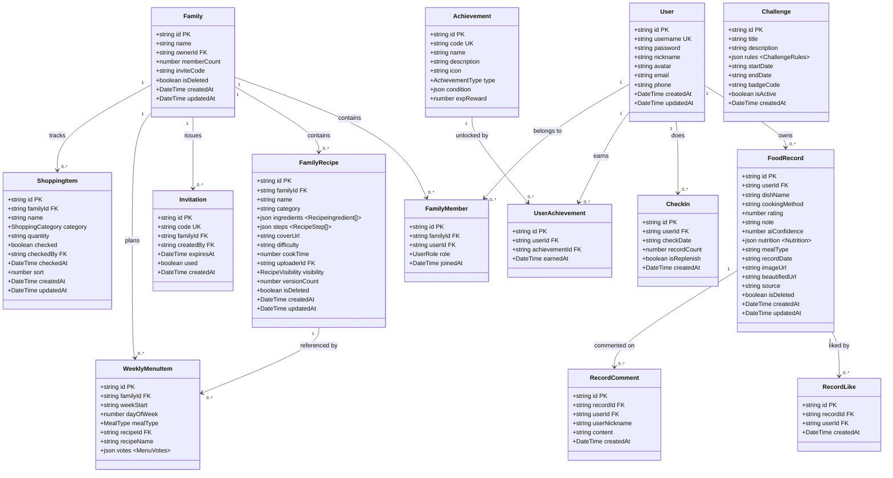
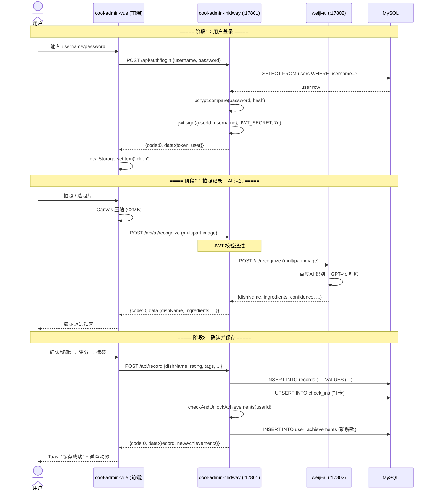
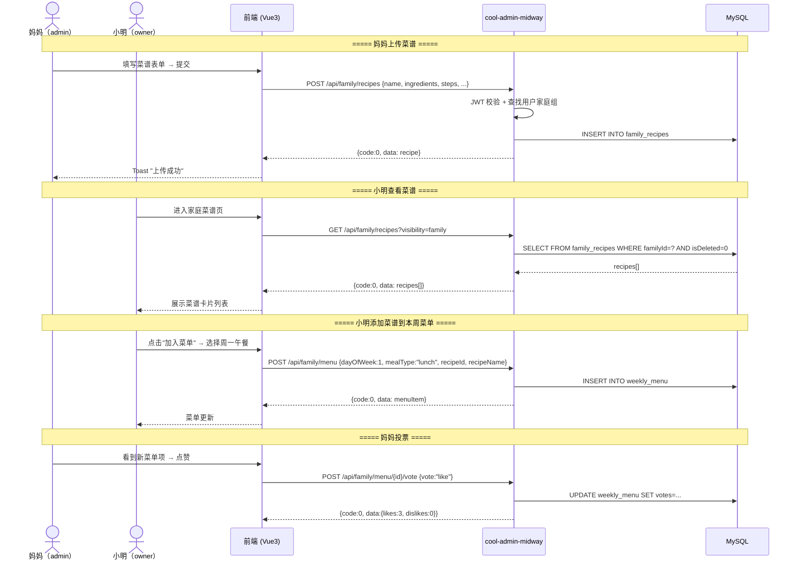
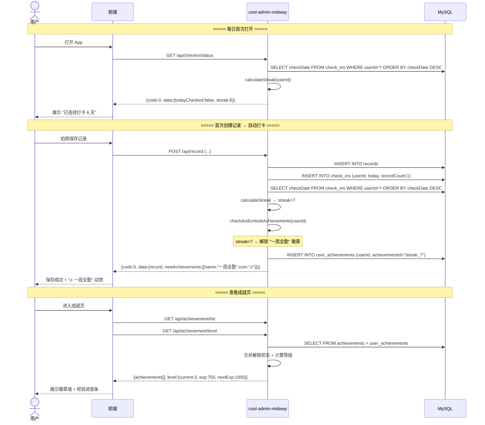
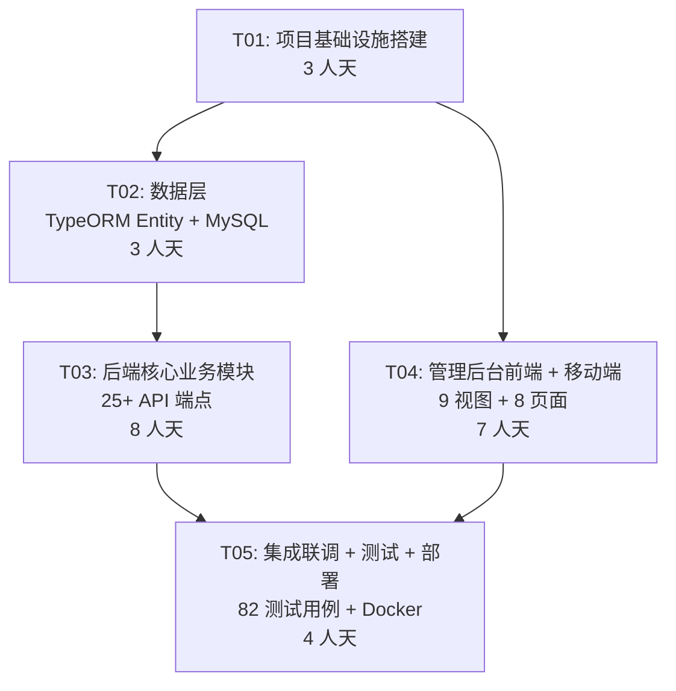

# 味记（AromaMemoir）全量迁移至 cool-admin — 架构设计方案

> **作者：** 高见远（架构师）  
> **日期：** 2026-06-30  
> **版本：** v1.0  
> **状态：** 待评审

---

## 目录

- [Part A: 系统设计](#part-a-系统设计)
  - [1. 实现方案与框架选型](#1-实现方案与框架选型)
  - [2. 文件列表](#2-文件列表)
  - [3. 数据结构与接口（类图）](#3-数据结构与接口类图)
  - [4. 程序调用流程（时序图）](#4-程序调用流程时序图)
  - [5. 待明确事项](#5-待明确事项)
- [Part B: 任务分解](#part-b-任务分解)
  - [6. 依赖包列表](#6-依赖包列表)
  - [7. 任务列表](#7-任务列表)
  - [8. 共享知识](#8-共享知识)
  - [9. 任务依赖图](#9-任务依赖图)

---

## Part A: 系统设计

---

## 1. 实现方案与框架选型

### 1.1 核心架构决策

```
┌──────────────────────────────────────────────────────────────────────┐
│                         客户端层                                      │
│   cool-admin-vue (管理后台)  │  cool-uni (移动端 H5/小程序/App)       │
│   Vue3 + Element Plus       │  uni-app + Vue3                       │
│   端口: 17900                 │  端口: 8080                            │
└──────────────────────────────┬───────────────────────────────────────┘
                               │ HTTP / WebSocket
┌──────────────────────────────▼───────────────────────────────────────┐
│                   cool-admin-midway (业务后端)                         │
│   Midway.js 3.x + TypeORM + MySQL + Redis + BullMQ                  │
│   端口: 17801                                                         │
│   ┌──────────┬──────────┬──────────┬──────────┬──────────┐          │
│   │ Auth     │ Record   │ Family   │ Checkin  │ Achievement│         │
│   │ Controller│Controller│Controller│Controller│Controller │         │
│   ├──────────┼──────────┼──────────┼──────────┼──────────┤          │
│   │  JWT Guard │  RBAC   │  AI Proxy  │  Logger   │  Swagger  │      │
│   └──────────┴──────────┴──────────┴──────────┴──────────┘          │
└──────────────────────────────┬───────────────────────────────────────┘
                               │ HTTP (内网)
┌──────────────────────────────▼───────────────────────────────────────┐
│                   weiji-ai (AI 服务，不变)                             │
│   FastAPI + 百度AI/通义千问/火山引擎/讯飞ASR/GPT-4o                  │
│   端口: 17802                                                         │
└──────────────────────────────┬───────────────────────────────────────┘
                               │
┌──────────────────────────────▼───────────────────────────────────────┐
│                         数据层                                        │
│   MySQL 8.0+ (主库)  │  Redis 7+ (缓存/队列/会话)                     │
└──────────────────────────────────────────────────────────────────────┘
```

### 1.2 框架选型详解

| 层次 | 框架 | 版本 | 选型理由 |
|------|------|------|----------|
| **后端框架** | Midway.js | 3.20+ | cool-admin 官方后端框架，依赖注入 + 装饰器 + Swagger 自动生成，完美替代现有 Koa 装饰器路由 |
| **ORM** | TypeORM | 0.3+ | cool-admin 内置，支持 Active Record 和 Data Mapper 两种模式，与 Midway.js 深度集成 |
| **权限管理** | cool-admin RBAC | 内置 | 开箱即用的用户-角色-菜单三级权限，可复用改造为家庭组角色模型 |
| **缓存** | Redis + ioredis | 7+ | cool-admin 内置 Redis 支持，用于缓存、会话、BullMQ 队列 |
| **任务队列** | BullMQ | 5+ | 基于 Redis 的分布式任务队列，处理异步 AI 贴纸生成、报告生成 |
| **文件上传** | cool-admin 文件模块 | 内置 | 支持本地/OSS/COS 多种存储模式 |
| **管理前端** | cool-admin-vue | latest | Vue3 + Vite + Element Plus，cool-admin 官方管理后台 |
| **移动端** | cool-uni | latest | uni-app 框架，一套代码编译 H5/微信小程序/App |
| **AI 服务** | FastAPI（weiji-ai） | 现有 | 保持不变，仅通过业务后端代理调用 |

### 1.3 关键技术映射

#### 现有 Koa 装饰器 → Midway.js 装饰器

| 现有 (weiji-server) | 迁移后 (cool-admin-midway) |
|---------------------|---------------------------|
| `@Controller('/api/xxx')` | `@Controller('/api/xxx')` |
| `@Get('/path')` / `@Post('/path')` | `@Get('/path')` / `@Post('/path')` |
| `@Patch('/path')` / `@Delete('/path')` | `@Patch('/path')` / `@Del('/path')` |
| `ctx.state.user` (JWT) | `@Inject() ctx` + `@CoolController` 内置鉴权 |
| 手动 `uuid()` 生成 | TypeORM `@PrimaryGeneratedColumn('uuid')` |
| `InMemoryRepository<T>` | TypeORM `Repository<T>` |
| 手动 JWT 校验中间件 | `@CoolUrlTag()` + 内置 JWT Guard |

#### 现有内存存储 → TypeORM Entity

| 现有 12 个 Repository | 迁移后 TypeORM Entity |
|-----------------------|----------------------|
| `users` → `InMemoryRepository<User>` | `User` Entity |
| `families` → `InMemoryRepository<Family>` | `Family` Entity |
| `family_members` → `InMemoryRepository<FamilyMember>` | `FamilyMember` Entity |
| `family_recipes` → `InMemoryRepository<FamilyRecipe>` | `FamilyRecipe` Entity |
| `invitations` → `InMemoryRepository<Invitation>` | `Invitation` Entity |
| `records` → `InMemoryRepository<Record>` | `FoodRecord` Entity (避免与 TS Record 类型冲突) |
| `weekly_menu` → `InMemoryRepository<WeeklyMenuItem>` | `WeeklyMenuItem` Entity |
| `shopping_items` → `InMemoryRepository<ShoppingItem>` | `ShoppingItem` Entity |
| `achievements` → `InMemoryRepository<AchievementDef>` | `Achievement` Entity |
| `user_achievements` → `InMemoryRepository<UserAchievement>` | `UserAchievement` Entity |
| `check_ins` → `InMemoryRepository<CheckIn>` | `CheckIn` Entity |
| `challenges` → `InMemoryRepository<Challenge>` | `Challenge` Entity |

#### API 接口对等映射

所有 25+ API 接口保持路径和契约不变：

| 现有端点 | 迁移后路径 | HTTP 方法 | 功能 |
|----------|-----------|-----------|------|
| `/api/auth/login` | 同 | POST | 登录 |
| `/api/auth/register` | 同 | POST | 注册 |
| `/api/auth/logout` | 同 | POST | 登出 |
| `/api/record/list` | 同 | GET | 记录列表（分页） |
| `/api/record` | 同 | POST | 创建记录 |
| `/api/record/:id` | 同 | GET | 记录详情 |
| `/api/family` | 同 | GET/POST | 查询/创建家庭组 |
| `/api/family/members` | 同 | GET | 家庭成员列表 |
| `/api/family/members/:id` | 同 | PATCH/DELETE | 修改角色/移除成员 |
| `/api/family/invitations` | 同 | POST/GET | 生成/查看邀请码 |
| `/api/family/join` | 同 | POST | 加入家庭组 |
| `/api/family/recipes` | 同 | GET/POST | 菜谱列表/上传 |
| `/api/family/recipes/:id` | 同 | GET/PUT/DELETE | 菜谱详情/编辑/删除 |
| `/api/family/recipes/:id/visibility` | 同 | PATCH | 切换可见性 |
| `/api/family/menu` | 同 | GET/POST | 周菜单 |
| `/api/family/menu/:id/vote` | 同 | POST | 菜单投票 |
| `/api/family/shopping` | 同 | GET/POST | 购物清单 |
| `/api/family/shopping/:id` | 同 | PATCH/DELETE | 勾选/删除 |
| `/api/family/shopping/generate` | 同 | POST | 根据菜单生成清单 |
| `/api/family/records` | 同 | GET | 家庭动态 |
| `/api/family/records/:id/like` | 同 | POST | 点赞/取消 |
| `/api/family/records/:id/comments` | 同 | POST | 评论 |
| `/api/family/report` | 同 | GET | 月度饮食报告 |
| `/api/achievement/list` | 同 | GET | 成就列表 |
| `/api/achievement/level` | 同 | GET | 等级信息 |
| `/api/checkin/status` | 同 | GET | 打卡状态 |
| `/api/checkin` | 同 | POST | 打卡 |
| `/api/checkin/replenish` | 同 | POST | 补签 |
| `/api/challenge/list` | 同 | GET | 挑战列表 |
| `/api/user/profile` | 同 | GET | 用户信息 |
| `/api/user/profile` | 同 | PUT | 更新用户信息 |
| `/api/ai/recognize` | 同 | POST | AI 识别 |
| `/api/ai/beautify` | 同 | POST | AI 美化 |
| `/api/ai/recommend` | 同 | POST | 菜谱推荐 |
| `/api/ai/voice/recognize` | 同 | POST | 语音识别 |
| `/api/ai/sticker` | 同 | POST | AI 贴纸 |
| `/api/health` | 同 | GET | 健康检查 |
| `/api/gamification/pokedex` | 同 | GET | 美食图鉴 |
| `/api/gamification/personality` | 同 | GET | 食物人格 |
| `/api/gamification/timemachine` | 同 | GET | 美食时光机 |
| `/api/gamification/blindguess/*` | 同 | POST/GET/PATCH | 盲猜玩法 |

---

## 2. 文件列表

### 2.1 后端项目：`weiji-server/`（cool-admin-midway）

```
weiji-server/
├── package.json                    # 项目依赖与脚本
├── tsconfig.json                   # TypeScript 编译配置
├── bootstrap.js                    # cool-admin 启动入口
├── src/
│   ├── app.ts                      # Midway 应用配置（端口、CORS、中间件）
│   ├── configuration.ts            # cool-admin 生命周期配置
│   ├── interface.ts                # 共享 TypeScript 类型定义（从 store/types.ts 迁移）
│   ├── global.ts                   # 全局常量（JWT_SECRET、AI_URL 等）
│   ├── entities/                   # TypeORM Entity 层
│   │   ├── index.ts                # Entity 统一导出
│   │   ├── User.ts                 # users 表
│   │   ├── Family.ts               # families 表
│   │   ├── FamilyMember.ts         # family_members 表
│   │   ├── FamilyRecipe.ts         # family_recipes 表
│   │   ├── Invitation.ts           # invitations 表
│   │   ├── FoodRecord.ts           # records 表（核心）
│   │   ├── WeeklyMenuItem.ts       # weekly_menu 表
│   │   ├── ShoppingItem.ts         # shopping_items 表
│   │   ├── Achievement.ts          # achievements 表
│   │   ├── UserAchievement.ts      # user_achievements 表
│   │   ├── CheckIn.ts              # check_ins 表
│   │   ├── Challenge.ts            # challenges 表
│   │   ├── RecordLike.ts           # record_likes 表（新增持久化）
│   │   └── RecordComment.ts        # record_comments 表（新增持久化）
│   ├── controller/                 # 控制器层（替换现有装饰器控制器）
│   │   ├── BaseController.ts       # cool-admin 基础控制器（注入 ctx、统一响应）
│   │   ├── AuthController.ts       # /api/auth/*
│   │   ├── RecordController.ts     # /api/record/*
│   │   ├── FamilyController.ts     # /api/family/*
│   │   ├── CheckinController.ts    # /api/checkin/*
│   │   ├── AchievementController.ts # /api/achievement/*
│   │   ├── ChallengeController.ts  # /api/challenge/*
│   │   ├── UserController.ts       # /api/user/*
│   │   ├── AiController.ts         # /api/ai/*（代理到 weiji-ai）
│   │   ├── HealthController.ts     # /api/health
│   │   └── GamificationController.ts # /api/gamification/*
│   ├── service/                    # 服务层
│   │   ├── AuthService.ts          # 认证逻辑（JWT签发/校验）
│   │   ├── RecordService.ts        # 记录 CRUD + 打卡联动
│   │   ├── FamilyService.ts        # 家庭组业务逻辑
│   │   ├── CheckinService.ts       # 打卡/补签/连续天数计算
│   │   ├── AchievementService.ts   # 成就检查与解锁
│   │   ├── ChallengeService.ts     # 挑战赛管理
│   │   ├── AiProxyService.ts       # AI 服务 HTTP 代理
│   │   ├── GamificationService.ts  # 图鉴/人格/时光机/盲猜逻辑
│   │   └── ReportService.ts        # 月报/年报生成
│   ├── middleware/                 # 中间件
│   │   └── AuthMiddleware.ts       # JWT 认证中间件（兼容 cool-admin 鉴权）
│   └── schedule/                   # 定时任务（BullMQ）
│       └── ReportScheduler.ts      # 月度家庭报告自动生成
├── db/
│   └── init.sql                    # MySQL 建表脚本 + 种子数据（从现有 init.sql 适配 TypeORM 命名）
└── tests/                          # 测试
    ├── unit/                       # 36 个单元测试（从现有迁移）
    └── integration/                # 集成测试
```

### 2.2 管理前端项目：`weiji-admin-web/`（cool-admin-vue）

```
weiji-admin-web/
├── package.json                    # 项目依赖
├── vite.config.ts                  # Vite 构建配置（proxy → :17801）
├── tsconfig.json                   # TypeScript 配置
├── index.html                      # 入口 HTML
├── src/
│   ├── main.ts                     # Vue 应用入口
│   ├── App.vue                     # 根组件
│   ├── env.d.ts                    # 环境类型声明
│   ├── api/                        # API 客户端
│   │   ├── client.ts              # axios 实例（baseURL + JWT 拦截）
│   │   ├── auth.ts                # 认证 API
│   │   ├── record.ts              # 记录 API
│   │   ├── family.ts              # 家庭组 API
│   │   ├── achievement.ts         # 成就 API
│   │   ├── checkin.ts             # 打卡 API
│   │   └── ai.ts                  # AI API
│   ├── router/
│   │   └── index.ts               # Vue Router 路由定义
│   ├── stores/
│   │   ├── auth.ts                # 认证状态（Pinia）
│   │   ├── family.ts              # 家庭组状态
│   │   └── record.ts              # 记录状态
│   ├── views/                      # 页面组件（9 个视图）
│   │   ├── Login.vue              # 登录页
│   │   ├── Home.vue               # 首页/记录列表
│   │   ├── AiRecord.vue           # AI 拍照记录
│   │   ├── FamilyRecipes.vue      # 家庭菜谱空间
│   │   ├── RecipeDetail.vue       # 菜谱详情
│   │   ├── RecipeForm.vue         # 菜谱上传/编辑表单
│   │   ├── Achievements.vue       # 成就徽章页
│   │   ├── Profile.vue            # 个人中心
│   │   └── Gameplay.vue           # 娱乐玩法（图鉴/人格/时光机/盲猜）
│   ├── components/                 # 共享组件
│   │   ├── Layout.vue             # 主布局（导航栏+内容区）
│   │   ├── RecordCard.vue         # 记录卡片
│   │   ├── CalendarView.vue       # 日历视图
│   │   ├── RatingStars.vue        # 评分组件
│   │   ├── WeeklyMenu.vue         # 周菜单网格
│   │   ├── ShoppingList.vue       # 购物清单
│   │   ├── CheckinCalendar.vue    # 打卡日历
│   │   ├── AchievementBadge.vue   # 徽章展示
│   │   └── VoiceInput.vue         # 语音输入
│   └── styles/
│       └── global.css             # 全局样式
└── tests/
    └── unit/                       # 25 个 Vitest 测试用例（从现有迁移）
```

### 2.3 移动端项目：`weiji-app/`（cool-uni）

```
weiji-app/
├── package.json                    # 项目依赖
├── vite.config.ts                  # uni-app Vite 配置
├── pages.json                      # uni-app 页面配置
├── manifest.json                   # 应用配置
├── App.vue                         # 应用根组件
├── main.ts                         # 入口
├── api/                            # API 客户端
│   └── client.ts                  # uni.request 封装
├── pages/                          # 页面（8 个核心页面）
│   ├── index/                     # 首页 — 记录列表
│   │   └── index.vue
│   ├── record/                    # 拍照记录
│   │   └── index.vue
│   ├── diary/                     # 美食日记（日历视图）
│   │   └── index.vue
│   ├── family/                    # 家庭组
│   │   ├── index.vue             # 家庭主页
│   │   ├── recipes.vue           # 菜谱空间
│   │   └── menu.vue              # 协作菜单
│   ├── checkin/                   # 打卡
│   │   └── index.vue
│   ├── achievement/               # 成就
│   │   └── index.vue
│   ├── profile/                   # 个人中心
│   │   └── index.vue
│   └── gameplay/                  # 娱乐玩法（图鉴/人格/盲猜）
│       └── index.vue
├── components/                     # 共享组件
│   ├── RecordItem.vue             # 记录条目
│   ├── FoodCard.vue               # 美食卡片
│   └── TabBar.vue                 # 底部导航
├── stores/                         # 状态管理
│   ├── auth.ts                    # 认证状态
│   └── record.ts                  # 记录状态
└── static/                         # 静态资源
    └── images/
```

---

## 3. 数据结构与接口（类图）

### 3.1 12 张核心表 TypeORM Entity 设计



### 3.2 服务层核心接口

```mermaid
classDiagram
    direction TB

    class AuthService {
        +login(username, password) Promise~LoginResult~
        +register(username, password, nickname) Promise~LoginResult~
        +logout() void
        +validateToken(token) Promise~JwtPayload~
        +generateToken(user) string
    }

    class RecordService {
        +list(userId, query) Promise~PaginatedResult~
        +create(userId, body) Promise~FoodRecord~
        +getById(id, userId) Promise~FoodRecord~
        +delete(id, userId) Promise~void~
    }

    class FamilyService {
        +getFamily(userId) Promise~Family~
        +createFamily(userId, name) Promise~Family~
        +getMembers(familyId) Promise~FamilyMember[]~
        +updateRole(operatorId, memberId, role) Promise~FamilyMember~
        +removeMember(operatorId, memberId) Promise~void~
        +createInvitation(userId, familyId) Promise~Invitation~
        +joinByCode(userId, code) Promise~Family~
        +listRecipes(familyId, filters) Promise~FamilyRecipe[]~
        +uploadRecipe(uploaderId, body) Promise~FamilyRecipe~
        +updateRecipe(userId, recipeId, patch) Promise~FamilyRecipe~
        +deleteRecipe(userId, recipeId) Promise~void~
        +getMenu(familyId) Promise~WeeklyMenuItem[]~
        +addMenuItem(familyId, item) Promise~WeeklyMenuItem~
        +voteMenuItem(userId, menuId, voteType) Promise~MenuVotes~
        +getShoppingList(familyId) Promise~ShoppingItem[]~
        +addShoppingItem(familyId, item) Promise~ShoppingItem~
        +toggleShoppingItem(userId, itemId, checked) Promise~ShoppingItem~
        +deleteShoppingItem(itemId) Promise~void~
        +generateShoppingFromMenu(familyId) Promise~ShoppingGenerateResult~
        +getFamilyRecords(familyId, page, pageSize) Promise~PaginatedResult~
        +toggleLike(userId, recordId) Promise~LikeResult~
        +addComment(userId, recordId, content) Promise~RecordComment~
        +getMonthlyReport(familyId, month) Promise~FamilyDietReport~
    }

    class CheckinService {
        +getStatus(userId) Promise~CheckinStatus~
        +doCheckin(userId) Promise~CheckinResult~
        +replenish(userId) Promise~CheckinResult~
        +calculateStreak(userId) Promise~number~
        +lastCheckDate(userId) Promise~string~
        +todayStr() string
    }

    class AchievementService {
        +listAchievements(userId) Promise~AchievementWithStatus[]~
        +getLevel(userId) Promise~LevelInfo~
        +checkAndUnlock(userId) Promise~Achievement[]~
        +calculateExp(userId) Promise~number~
    }

    class AiProxyService {
        +recognize(imageBuffer) Promise~RecognizeResult~
        +beautify(imageBuffer, style) Promise~BeautifyResult~
        +recommend(dishName, context) Promise~RecommendResult~
        +voiceRecognize(audioBuffer) Promise~VoiceResult~
        +sticker(imageBuffer, style) Promise~StickerResult~
        +healthCheck() Promise~boolean~
    }

    class GamificationService {
        +getPokedex(userId) Promise~PokedexSummary~
        +getPersonality(userId) Promise~PersonalityReport~
        +getTimemachine(userId) Promise~TimemachineResult~
        +createBlindRound(familyId, creatorId, items) Promise~BlindGuessRound~
        +submitBlindGuess(userId, roundId, guesses) Promise~BlindGuessGuess[]~
        +revealBlindRound(roundId) Promise~BlindGuessResult~
    }

    class ReportService {
        +generateMonthlyReport(familyId, month) Promise~FamilyDietReport~
        +scheduleMonthlyReports() Promise~void~
    }
```



---

## 4. 程序调用流程（时序图）

### 4.1 用户登录 → 记录创建 → AI 识别



### 4.2 家庭菜谱共享



### 4.3 打卡 → 成就解锁



---

## 5. 待明确事项

| # | 事项 | 影响范围 | 建议决策 | 优先级 |
|---|------|----------|----------|--------|
| 1 | **cool-admin 版本选择**：Midway 社区版 vs 企业版？企业版有更多内置模块（数据回收站、多租户等） | 后端架构 | 建议先用社区版（免费），后续按需升级 | P1 |
| 2 | **图片存储方案**：本地文件系统 / 阿里云 OSS / 腾讯云 COS？现有代码使用本地 assets/ | 文件上传模块 | 建议 MVP 阶段用本地存储 + Nginx 静态服务，增长期切 OSS | P1 |
| 3 | **weiji-ai 是否要适配 cool-admin 响应格式**？目前 AI 服务返回格式与 `{code, data, message}` 不完全一致 | AI 代理层 | 建议 AI 代理层做格式转换，weiji-ai 保持不变 | P0 |
| 4 | **微信登录集成时机**：P0 还是 P1？现有仅 username/password 登录 | 认证模块 | 建议 P1 阶段集成，MVP 先用密码登录跑通闭环 | P1 |
| 5 | **MySQL 版本要求**：init.sql 使用 MySQL 8.0+ 特性（JSON、CHECK 约束），是否需要兼容 5.7？ | 数据库 | 建议要求 MySQL 8.0+，不做 5.7 兼容 | P2 |
| 6 | **移动端平台优先级**：H5 优先还是微信小程序优先？ | cool-uni 开发 | 建议 H5 优先（快速验证），小程序紧随其后 | P1 |
| 7 | **测试策略**：现有 82 个测试用例是否全部迁移？还是重写？ | 测试 | 后端 36 个 node:test → Midway.js 内置测试框架重写；前端 25 个 Vitest → 保留；AI 21 个 pytest → 不变 | P0 |
| 8 | **pokedexCatalog / personalityTypes / blindGuessRounds** 这3个无 id 的内存结构如何持久化？ | 数据层 | pokedexCatalog 和 personalityTypes 作为静态配置 JSON 文件；blindGuessRounds 新增 MySQL 表 | P0 |

---

## Part B: 任务分解

---

## 6. 依赖包列表

### 6.1 weiji-server（cool-admin-midway 后端）

```
- @midwayjs/core@^3.20.0           # Midway 核心框架
- @midwayjs/koa@^3.20.0            # Koa 适配层
- @midwayjs/typeorm@^3.20.0        # TypeORM 集成
- @midwayjs/validate@^3.20.0       # 参数校验
- @midwayjs/swagger@^3.20.0        # API 文档自动生成
- @midwayjs/redis@^3.20.0          # Redis 集成
- @midwayjs/bull@^3.20.0           # BullMQ 任务队列
- @midwayjs/jwt@^3.20.0            # JWT 认证
- typeorm@^0.3.20                  # ORM
- mysql2@^3.22.5                   # MySQL 驱动
- bcryptjs@^2.4.3                  # 密码哈希
- axios@^1.7.0                     # HTTP 代理（AI 服务调用）
- dotenv@^17.4.2                   # 环境变量
- class-validator@^0.14.0          # DTO 校验
- class-transformer@^0.5.0         # DTO 转换
- ioredis@^5.4.0                   # Redis 客户端
- bullmq@^5.0.0                    # 任务队列
- uuid@^9.0.0                      # UUID 生成
- typescript@^5.4.0                # TypeScript 编译
- @types/node@^20.0.0              # Node 类型
- @types/bcryptjs@^2.4.6           # bcrypt 类型
- ts-node@^10.9.0                  # TS 执行
- tsx@^4.19.0                      # TS 执行（测试用）
- supertest@^6.3.0                 # HTTP 测试
```

### 6.2 weiji-admin-web（cool-admin-vue 管理前端）

```
- vue@^3.4.0                       # Vue3 框架
- vue-router@^4.3.0                # 路由
- pinia@^2.1.0                     # 状态管理
- element-plus@^2.5.0              # UI 组件库
- axios@^1.7.0                     # HTTP 客户端
- @vitejs/plugin-vue@^5.0.0        # Vite Vue 插件
- vite@^5.0.0                      # 构建工具
- typescript@^5.4.0                # TypeScript
- sass@^1.70.0                     # SCSS 预处理器
- @element-plus/icons-vue@^2.3.0   # Element Plus 图标
- dayjs@^1.11.0                    # 日期处理
- vitest@^1.0.0                    # 测试框架
- @vue/test-utils@^2.4.0           # Vue 组件测试
- jsdom@^24.0.0                    # DOM 模拟（测试）
```

### 6.3 weiji-app（cool-uni 移动端）

```
- @dcloudio/uni-app@^3.0.0         # uni-app 框架
- @dcloudio/uni-mp-weixin@^3.0.0   # 微信小程序平台
- @dcloudio/uni-h5@^3.0.0          # H5 平台
- vue@^3.4.0                       # Vue3
- pinia@^2.1.0                     # 状态管理
- @dcloudio/uni-ui@^1.5.0          # uni-app 官方 UI 库
- dayjs@^1.11.0                    # 日期处理
- typescript@^5.4.0                # TypeScript
- vite@^5.0.0                      # 构建工具
- sass@^1.70.0                     # SCSS
```

---

## 7. 任务列表

> **拆分原则：** 按功能模块/层次分组，不按单文件拆分，总共不超过 5 个任务。

| 任务 ID | 任务名称 | 源文件（创建/修改） | 依赖 | 优先级 | 预估人天 |
|---------|----------|---------------------|------|--------|----------|
| **T01** | **项目基础设施搭建** | 见下 | 无 | P0 | 3 人天 |
| **T02** | **数据层 — TypeORM Entity + MySQL** | 见下 | T01 | P0 | 3 人天 |
| **T03** | **后端核心业务模块** | 见下 | T02 | P0 | 8 人天 |
| **T04** | **管理后台前端 + 移动端** | 见下 | T01 | P0 | 7 人天 |
| **T05** | **集成联调 + 测试 + 部署** | 见下 | T03, T04 | P0 | 4 人天 |

### T01 详细说明：项目基础设施搭建

**目标：** 创建三个子项目的基础工程结构，使项目可启动、可编译。

**源文件：**

| 文件 | 说明 |
|------|------|
| `weiji-server/package.json` | 后端依赖声明 |
| `weiji-server/tsconfig.json` | TypeScript 编译配置 |
| `weiji-server/bootstrap.js` | cool-admin 启动入口 |
| `weiji-server/src/app.ts` | Midway 应用配置（端口17801、CORS、中间件） |
| `weiji-server/src/configuration.ts` | cool-admin 生命周期配置 |
| `weiji-server/src/global.ts` | 全局常量（JWT_SECRET、AI_URL、DB配置） |
| `weiji-server/src/interface.ts` | 共享 TS 类型定义（从 store/types.ts 迁移，保留所有接口） |
| `weiji-admin-web/package.json` | 前端依赖声明 |
| `weiji-admin-web/vite.config.ts` | Vite 配置（proxy → :17801） |
| `weiji-admin-web/tsconfig.json` | TypeScript 配置 |
| `weiji-admin-web/index.html` | HTML 入口 |
| `weiji-admin-web/src/main.ts` | Vue 应用入口 |
| `weiji-admin-web/src/App.vue` | 根组件 |
| `weiji-admin-web/src/env.d.ts` | 类型声明 |
| `weiji-admin-web/src/router/index.ts` | 路由定义 |
| `weiji-admin-web/src/styles/global.css` | 全局样式 |
| `weiji-app/package.json` | 移动端依赖声明 |
| `weiji-app/vite.config.ts` | uni-app Vite 配置 |
| `weiji-app/pages.json` | 页面配置 |
| `weiji-app/manifest.json` | 应用配置 |
| `weiji-app/App.vue` | 根组件 |
| `weiji-app/main.ts` | 入口 |

**交付标准：** 三个子项目各自 `npm install && npm run dev` 可成功启动，空页面可见。

---

### T02 详细说明：数据层 — TypeORM Entity + MySQL

**目标：** 完成 12+2=14 张表的 TypeORM Entity 定义 + MySQL 建表脚本 + 种子数据。

**源文件：**

| 文件 | 说明 |
|------|------|
| `weiji-server/src/entities/User.ts` | users 表 Entity |
| `weiji-server/src/entities/Family.ts` | families 表 Entity |
| `weiji-server/src/entities/FamilyMember.ts` | family_members 表 Entity |
| `weiji-server/src/entities/FamilyRecipe.ts` | family_recipes 表 Entity（JSON 字段映射） |
| `weiji-server/src/entities/Invitation.ts` | invitations 表 Entity |
| `weiji-server/src/entities/FoodRecord.ts` | records 表 Entity（核心，JSON 营养字段） |
| `weiji-server/src/entities/WeeklyMenuItem.ts` | weekly_menu 表 Entity（JSON votes） |
| `weiji-server/src/entities/ShoppingItem.ts` | shopping_items 表 Entity |
| `weiji-server/src/entities/Achievement.ts` | achievements 表 Entity（JSON condition） |
| `weiji-server/src/entities/UserAchievement.ts` | user_achievements 表 Entity |
| `weiji-server/src/entities/CheckIn.ts` | check_ins 表 Entity |
| `weiji-server/src/entities/Challenge.ts` | challenges 表 Entity（JSON rules） |
| `weiji-server/src/entities/RecordLike.ts` | record_likes 表 Entity（新增持久化） |
| `weiji-server/src/entities/RecordComment.ts` | record_comments 表 Entity（新增持久化） |
| `weiji-server/src/entities/index.ts` | Entity 统一导出 |
| `weiji-server/db/init.sql` | MySQL 建表脚本 + 种子数据（适配 TypeORM 命名规范） |

**交付标准：** TypeORM `synchronize: true` 可自动建表，或手动执行 `init.sql` 后 14 张表完整创建，种子数据与现有内存种子一致。

---

### T03 详细说明：后端核心业务模块

**目标：** 实现全部 25+ API 端点，功能与现有 weiji-server 对等。

**源文件：**

| 文件 | 说明 |
|------|------|
| `weiji-server/src/middleware/AuthMiddleware.ts` | JWT 认证中间件 |
| `weiji-server/src/service/AuthService.ts` | 认证服务（login/register/JWT签发/校验） |
| `weiji-server/src/service/RecordService.ts` | 记录服务（CRUD + 打卡联动） |
| `weiji-server/src/service/FamilyService.ts` | 家庭组服务（26个端点的业务逻辑） |
| `weiji-server/src/service/CheckinService.ts` | 打卡服务（打卡/补签/streak计算） |
| `weiji-server/src/service/AchievementService.ts` | 成就服务（检查/解锁/等级计算） |
| `weiji-server/src/service/ChallengeService.ts` | 挑战赛服务 |
| `weiji-server/src/service/AiProxyService.ts` | AI 代理服务（HTTP 转发到 weiji-ai） |
| `weiji-server/src/service/GamificationService.ts` | 娱乐化服务（图鉴/人格/时光机/盲猜） |
| `weiji-server/src/service/ReportService.ts` | 报告生成服务（月度/年度） |
| `weiji-server/src/controller/BaseController.ts` | 基础控制器（注入 ctx、统一响应） |
| `weiji-server/src/controller/AuthController.ts` | /api/auth/*（3 端点） |
| `weiji-server/src/controller/RecordController.ts` | /api/record/*（3 端点） |
| `weiji-server/src/controller/FamilyController.ts` | /api/family/*（26 端点，最大模块） |
| `weiji-server/src/controller/CheckinController.ts` | /api/checkin/*（3 端点） |
| `weiji-server/src/controller/AchievementController.ts` | /api/achievement/*（2 端点） |
| `weiji-server/src/controller/ChallengeController.ts` | /api/challenge/*（1 端点） |
| `weiji-server/src/controller/UserController.ts` | /api/user/*（2 端点） |
| `weiji-server/src/controller/AiController.ts` | /api/ai/*（5 端点，代理 weiji-ai） |
| `weiji-server/src/controller/HealthController.ts` | /api/health |
| `weiji-server/src/controller/GamificationController.ts` | /api/gamification/*（7 端点） |
| `weiji-server/src/schedule/ReportScheduler.ts` | 月度报告定时任务 |

**交付标准：** 所有 API 端点可调用，功能与现有 weiji-server 对等，响应格式 `{code, data, message}` 一致。

---

### T04 详细说明：管理后台前端 + 移动端

**目标：** 管理后台 9 视图迁移 + 移动端 8 页面迁移，功能与现有对等。

**管理前端源文件：**

| 文件 | 说明 |
|------|------|
| `weiji-admin-web/src/api/client.ts` | axios 实例 + JWT 拦截器 |
| `weiji-admin-web/src/api/auth.ts` | 认证 API 封装 |
| `weiji-admin-web/src/api/record.ts` | 记录 API 封装 |
| `weiji-admin-web/src/api/family.ts` | 家庭组 API 封装 |
| `weiji-admin-web/src/api/achievement.ts` | 成就 API 封装 |
| `weiji-admin-web/src/api/checkin.ts` | 打卡 API 封装 |
| `weiji-admin-web/src/api/ai.ts` | AI API 封装 |
| `weiji-admin-web/src/stores/auth.ts` | 认证状态（Pinia） |
| `weiji-admin-web/src/stores/family.ts` | 家庭组状态 |
| `weiji-admin-web/src/stores/record.ts` | 记录状态 |
| `weiji-admin-web/src/components/Layout.vue` | 主布局 |
| `weiji-admin-web/src/components/RecordCard.vue` | 记录卡片 |
| `weiji-admin-web/src/components/CalendarView.vue` | 日历视图 |
| `weiji-admin-web/src/components/RatingStars.vue` | 评分组件 |
| `weiji-admin-web/src/components/WeeklyMenu.vue` | 周菜单网格 |
| `weiji-admin-web/src/components/ShoppingList.vue` | 购物清单 |
| `weiji-admin-web/src/components/CheckinCalendar.vue` | 打卡日历 |
| `weiji-admin-web/src/components/AchievementBadge.vue` | 徽章展示 |
| `weiji-admin-web/src/components/VoiceInput.vue` | 语音输入 |
| `weiji-admin-web/src/views/Login.vue` | 登录页 |
| `weiji-admin-web/src/views/Home.vue` | 首页 |
| `weiji-admin-web/src/views/AiRecord.vue` | AI 拍照记录 |
| `weiji-admin-web/src/views/FamilyRecipes.vue` | 家庭菜谱 |
| `weiji-admin-web/src/views/RecipeDetail.vue` | 菜谱详情 |
| `weiji-admin-web/src/views/RecipeForm.vue` | 菜谱表单 |
| `weiji-admin-web/src/views/Achievements.vue` | 成就页 |
| `weiji-admin-web/src/views/Profile.vue` | 个人中心 |
| `weiji-admin-web/src/views/Gameplay.vue` | 娱乐玩法 |

**移动端源文件：**

| 文件 | 说明 |
|------|------|
| `weiji-app/api/client.ts` | uni.request 封装 |
| `weiji-app/pages/index/index.vue` | 首页 |
| `weiji-app/pages/record/index.vue` | 拍照记录 |
| `weiji-app/pages/diary/index.vue` | 美食日记 |
| `weiji-app/pages/family/index.vue` | 家庭主页 |
| `weiji-app/pages/family/recipes.vue` | 菜谱空间 |
| `weiji-app/pages/family/menu.vue` | 协作菜单 |
| `weiji-app/pages/checkin/index.vue` | 打卡 |
| `weiji-app/pages/achievement/index.vue` | 成就 |
| `weiji-app/pages/profile/index.vue` | 个人中心 |
| `weiji-app/pages/gameplay/index.vue` | 娱乐玩法 |
| `weiji-app/components/RecordItem.vue` | 记录条目 |
| `weiji-app/components/FoodCard.vue` | 美食卡片 |
| `weiji-app/components/TabBar.vue` | 底部导航 |
| `weiji-app/stores/auth.ts` | 认证状态 |
| `weiji-app/stores/record.ts` | 记录状态 |

**交付标准：** 管理后台 9 个视图可正常渲染和交互；移动端 H5 模式 8 个页面可正常访问和交互。

---

### T05 详细说明：集成联调 + 测试 + 部署

**目标：** 三服务端到端联调通过 + 82 个测试用例全绿 + 部署配置就绪。

**源文件：**

| 文件 | 说明 |
|------|------|
| `weiji-server/tests/unit/*.test.ts` | 36 个后端单元测试（迁移重写） |
| `weiji-server/tests/integration/*.test.ts` | 后端集成测试 |
| `weiji-admin-web/tests/unit/*.spec.ts` | 25 个前端单元测试（保留+适配） |
| `weiji-ai/tests/` | 21 个 AI 测试（不变） |
| `weiji-server/Dockerfile` | 后端 Docker 镜像 |
| `weiji-admin-web/Dockerfile` | 前端 Nginx Docker 镜像 |
| `docker-compose.yml` | 三服务 + MySQL + Redis 编排 |
| `weiji-server/.env.example` | 环境变量模板 |
| `README.md` | 部署文档 |

**交付标准：** `docker-compose up` 一键启动全部服务，核心闭环（登录→记录→AI识别→家庭菜谱→打卡→成就）端到端通过，82 个测试用例全绿。

---

## 8. 共享知识

### 8.1 全局响应格式

```typescript
// 所有 API 响应统一使用此格式
interface ApiResponse<T = any> {
  code: number;    // 0 = 成功，非0 = 错误码
  data: T;         // 响应数据
  message: string; // 提示信息
}

// 成功响应
function ok<T>(data: T, message = ''): ApiResponse<T> {
  return { code: 0, data, message };
}

// 失败响应
function fail(message: string, code = 400): ApiResponse {
  return { code, data: null, message };
}
```

### 8.2 命名规范

| 类别 | 规范 | 示例 |
|------|------|------|
| 文件名 | kebab-case | `family-recipe.entity.ts`, `ai-proxy.service.ts` |
| 类名 | PascalCase | `FamilyRecipe`, `AiProxyService` |
| 方法名 | camelCase | `getFamilyRecords()`, `checkAndUnlock()` |
| 变量/属性 | camelCase | `userId`, `dishName` |
| 常量 | UPPER_SNAKE_CASE | `JWT_SECRET`, `AI_SERVICE_URL` |
| 数据库表名 | snake_case | `family_recipes`, `user_achievements` |
| 数据库列名 | camelCase（TypeORM 默认） | `dishName`, `aiConfidence` |
| API 路径 | kebab-case | `/api/family/shopping/generate` |

### 8.3 API 路径约定

- 所有业务 API 前缀：`/api/`
- AI 代理路径：`/api/ai/*` → 转发 `weiji-ai:17802/ai/*`
- 健康检查：`/api/health`
- 静态文件：`/public/*`（图片等）

### 8.4 JWT 认证约定

- Token 位置：`Authorization: Bearer <token>`
- Token 有效期：7 天
- Payload：`{ userId: string, username: string, iat: number, exp: number }`
- 受保护端点：除 `/api/auth/login`、`/api/auth/register` 外的所有 `/api/*` 路径
- 前端 token 存储：`localStorage.setItem('token', value)`

### 8.5 数据库约定

- 主键：UUID v4 (CHAR(36))，由应用层生成（非 DB 自增）
- 软删除：`isDeleted: boolean`，查询时默认排除
- 时间戳：`createdAt` / `updatedAt`，ISO 8601 UTC 格式
- JSON 字段：`ingredients`、`steps`、`nutrition`、`condition`、`rules`、`votes` — MySQL JSON 类型
- 枚举：`role`、`visibility`、`mealType` — MySQL ENUM 类型

### 8.6 错误码约定

| code | 含义 | 使用场景 |
|------|------|----------|
| 0 | 成功 | 正常响应 |
| 400 | 请求参数错误 | 校验失败、业务逻辑拒绝 |
| 401 | 未认证 | Token 缺失或无效 |
| 403 | 无权限 | 非 owner/admin 操作 |
| 404 | 资源不存在 | 记录/菜谱/成员不存在 |
| 500 | 服务器内部错误 | 未捕获异常 |
| 503 | 服务不可用 | AI 服务不可达 |

---

## 9. 任务依赖图



**总预估人天：25 人天**（约 5 周，1 人全栈）

**关键路径：** T01 → T02 → T03 → T05（18 人天，约 3.6 周）

---

> **文档结束** — 本方案完整覆盖了从底层数据模型到前端 UI、从移动端到部署配置的全栈架构设计，共 5 个有序任务，每任务至少 3+ 源文件，预估总人天 25 天。
