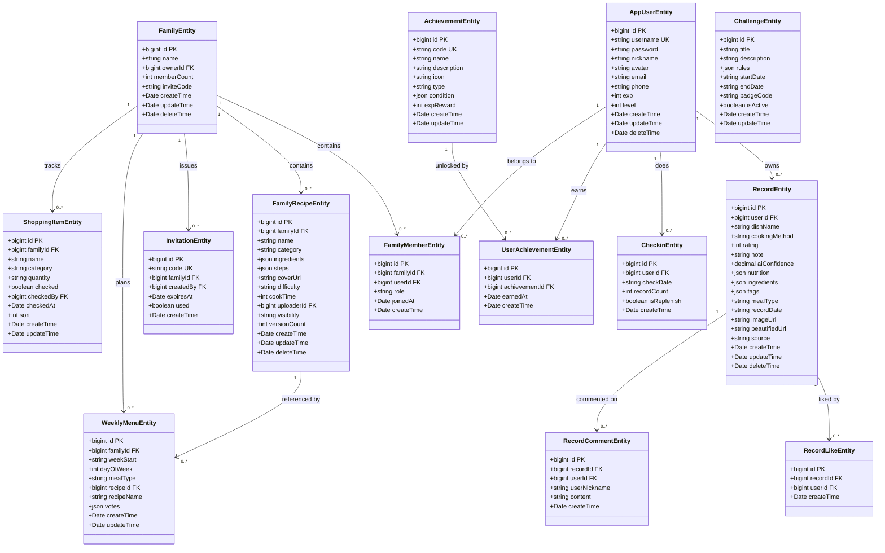
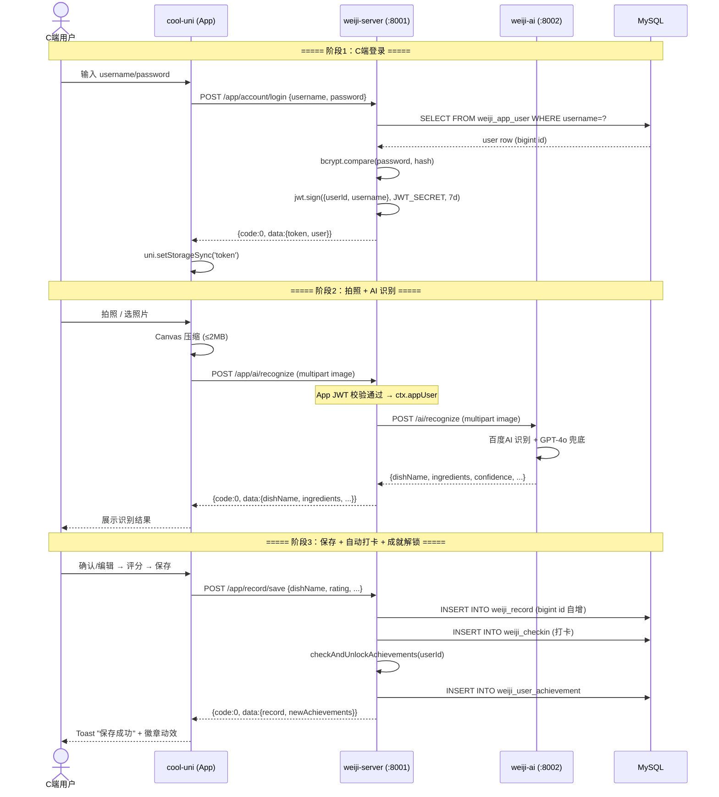
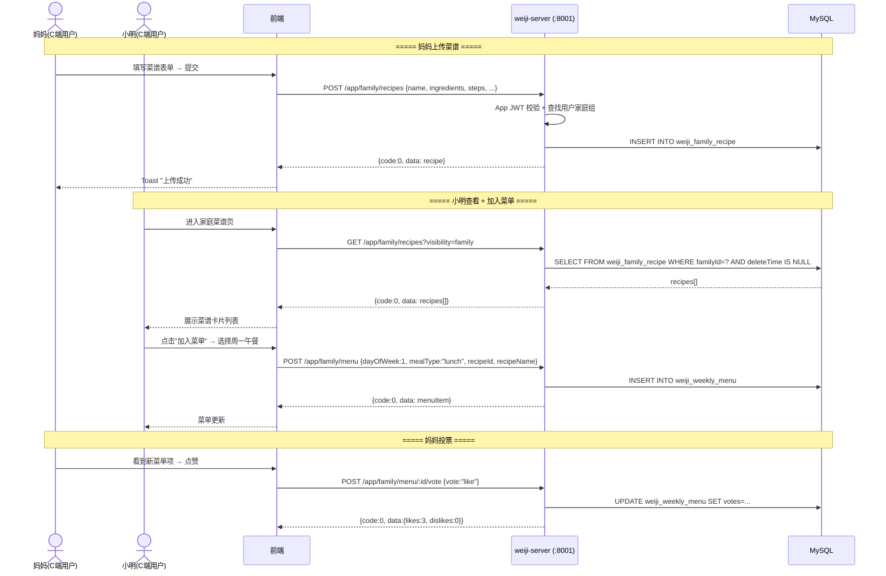
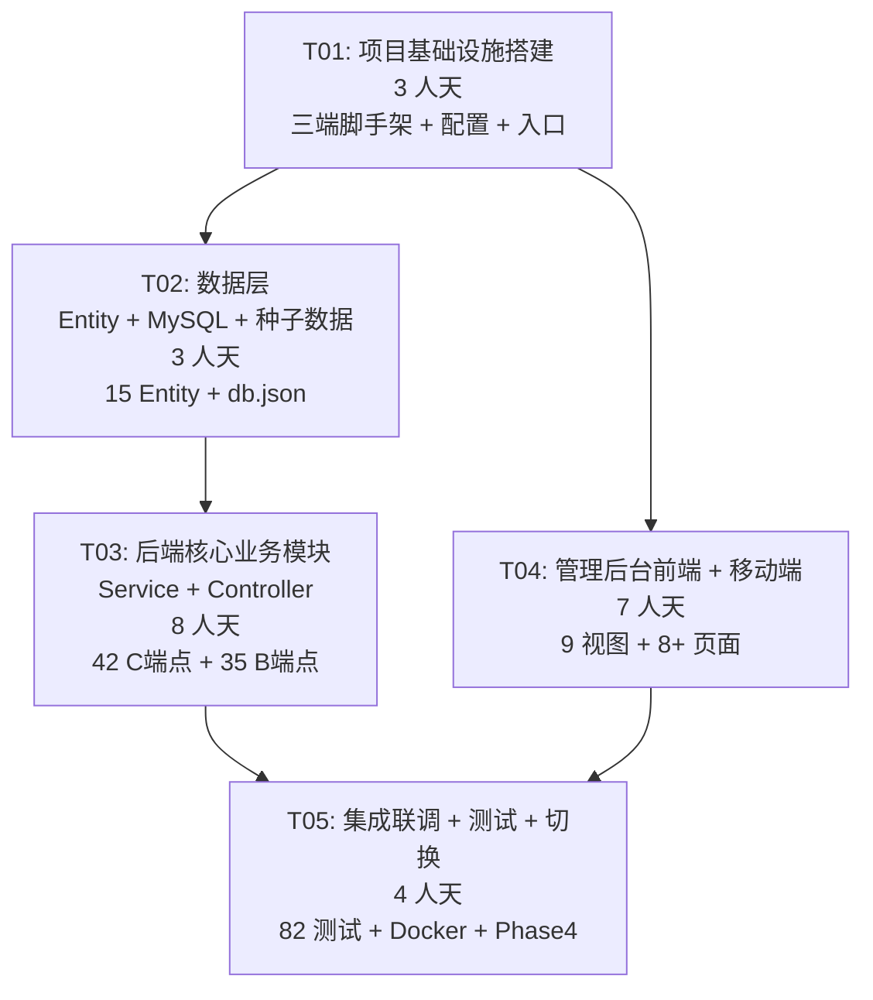

# 味记（AromaMemoir）全量迁移至 cool-admin — 架构设计方案 v2.0

> **作者：** 高见远（架构师）  
> **日期：** 2026-07-01  
> **版本：** v2.0（对齐「架构设计与迁移方案.md」全部决策）  
> **状态：** 待评审

---

## 目录

- [1. 决策记录 D1–D7](#1-决策记录-d1d7)
- [2. 现状与目标差距](#2-现状与目标差距)
- [3. 目标架构总览](#3-目标架构总览)
  - [3.1 架构拓扑（ASCII Art）](#31-架构拓扑ascii-art)
  - [3.2 端口与技术栈](#32-端口与技术栈)
  - [3.3 API 分层设计](#33-api-分层设计)
  - [3.4 工程布局（-next 并行策略）](#34-工程布局-next-并行策略)
- [4. 完整 API 路径映射表（40+ 端点）](#4-完整-api-路径映射表40-端点)
- [5. 完整目录结构（modules/ 约定）](#5-完整目录结构modules-约定)
  - [5.1 weiji-server-next 目录结构](#51-weiji-server-next-目录结构)
  - [5.2 weiji-admin-web-next 目录结构](#52-weiji-admin-web-next-目录结构)
  - [5.3 weiji-app-next 目录结构](#53-weiji-app-next-目录结构)
- [6. 数据模型设计（含完整 Entity 代码示例）](#6-数据模型设计含完整-entity-代码示例)
  - [6.1 BaseEntity 继承范式](#61-baseentity-继承范式)
  - [6.2 核心 Entity 完整代码](#62-核心-entity-完整代码)
  - [6.3 数据模型映射表（12+ 表 → Entity）](#63-数据模型映射表12-表--entity)
  - [6.4 通用字段变更](#64-通用字段变更)
- [7. Controller 设计（含完整代码示例）](#7-controller-设计含完整代码示例)
  - [7.1 B 端管理 Controller（cl-crud 一行生成）](#71-b-端管理-controllercl-crud-一行生成)
  - [7.2 C 端业务 Controller（手写业务逻辑）](#72-c-端业务-controller手写业务逻辑)
- [8. Config 配置文件完整示例](#8-config-配置文件完整示例)
- [9. C 端/B 端用户分离设计](#9-c-端b-端用户分离设计)
- [10. 分阶段路线图 Phase 0–4](#10-分阶段路线图-phase-04)
- [11. 任务分解（5 个任务，含文件清单）](#11-任务分解5-个任务含文件清单)
  - [T01：项目基础设施搭建](#t01项目基础设施搭建-phase-0)
  - [T02：数据层 — Entity + MySQL + 种子数据](#t02数据层--entity--mysql--种子数据-phase-1-前半)
  - [T03：后端核心业务模块（Service + Controller）](#t03后端核心业务模块service--controller-phase-1-后半)
  - [T04：管理后台前端 + 移动端](#t04管理后台前端--移动端-phase-23)
  - [T05：集成联调 + 测试 + 切换](#t05集成联调--测试--切换-phase-4)
- [12. 依赖包列表（三端）](#12-依赖包列表三端)
- [13. 共享知识](#13-共享知识)
- [14. 风险与缓解](#14-风险与缓解)
- [15. 待确认事项 Q1–Q8](#15-待确认事项-q1q8)
- [16. 类图](#16-类图)
- [17. 时序图](#17-时序图)
- [18. 任务依赖图](#18-任务依赖图)

---

## 1. 决策记录 D1–D7

| # | 决策项 | 结论 | 依据 |
|---|--------|------|------|
| **D1** | 迁移策略 | **全新 cool-admin 脚手架 + 业务逻辑迁移**。基于官方脚手架重建三个工程，迁移现有实体/服务/SQL/页面/测试；旧代码保留作参考，切换完成后清理 | 用户确认 |
| **D2** | 本轮产出 | **架构设计文档 + 迁移路线图**，确认后再动代码 | 用户确认 |
| **D3** | AI 服务定位 | **保留 weiji-ai 为独立 AI 层**，weiji-server 通过 HTTP（`/app/ai/*` → `:8002`）调用 | 用户确认；与「cool-admin适配度分析.md」推荐的「cool-admin + Python AI 混合架构」一致 |
| **D4** | 移动端框架 | 采用 **cool-uni**（uni-app + Vue3 组合式 API），与现有 weiji-app 同源，迁移成本最低 | 用户确认（Q2） |
| **D5** | 主键策略 | 采用 cool-admin 默认 **自增 bigint 主键**，废弃现有 uuid 主键 | 用户确认（Q1）；cool-admin 全家桶（RBAC/CRUD/关联表）均假设自增 id |
| **D6** | 生产数据 | 现有库 **无生产数据**，无需保留历史数据、无需 id 映射脚本，Phase 4 直接重新灌种子 | 用户确认（Q3） |
| **D7** | 工程布局 | **新建 `-next` 后缀目录并行迁移**，旧目录保持可运行；Phase 4 删除旧目录并将 `-next` 重命名为正式名 | 用户确认（Q4） |

---

## 2. 现状与目标差距

| 目录 | 目标框架 | 实际现状 | 差距 | 迁移动作 |
|------|----------|----------|------|----------|
| `weiji-web/` | 功能参考原型 | 纯静态 HTML+JS，**功能最全**（30+ 业务、完整数据模型、7 页面） | 无需改造 | 标注为原型，加 README |
| `weiji-server/` | cool-admin-midway | **自研** Koa + Midway 风格装饰器（非真 cool-admin），11 控制器 + 12 张 MySQL 表 + 36 测试 | 框架需替换 | 用 cool-admin-midway 脚手架重建，迁移 entity/service/controller |
| `weiji-admin-web/` | cool-admin-vue | Vue3 + Element Plus **标准栈**（非 cool-admin-vue），9 页面 + 25 测试 | 需换脚手架 | 用 cool-admin-vue 脚手架重建，迁移页面 + 用 cl-crud 重写管理页 |
| `weiji-app/` | cool-uni | uni-app（Vue3.4，微信小程序为主），8 页面 | 需对齐 cool-uni 模板 | 用 cool-uni 脚手架重建，迁移页面 + 接入 Service 自动化 |
| `weiji-ai/` | （独立 AI 层） | FastAPI，6 厂商集成，21 测试，降级完善 | 无需改造 | 保持原样，仅被新 server 调用 |

**核心结论：** 现有三个工程都不是真正的 cool-admin 全家桶。"渐进改造"不可行——本质是用官方脚手架重建 + 业务迁移。

---

## 3. 目标架构总览

### 3.1 架构拓扑（ASCII Art）

```
┌──────────────────┐        ┌─────────────────────┐
│   weiji-app      │        │  weiji-admin-web    │
│   (cool-uni)     │        │  (cool-admin-vue)   │
│ H5 / 微信小程序   │        │  后台管理 + 业务页面 │
│   :5173(H5)      │        │      :9000          │
└────────┬─────────┘        └──────────┬──────────┘
         │                             │
         │      HTTPS / JWT            │
         ▼                             ▼
┌──────────────────────────────────────────────────┐
│         weiji-server (cool-admin-midway) :8001   │
│  ┌─────────────────┐    ┌──────────────────────┐ │
│  │  base 模块(内置) │    │   业务模块(modules)   │ │
│  │ RBAC/菜单/字典   │    │ account/record/      │ │
│  │ 日志/文件/任务   │    │ family/achievement/  │ │
│  │ /数据回收站      │    │ checkin/gamification │ │
│  │                  │    │ challenge/ai/        │ │
│  │                  │    │ analytics            │ │
│  └─────────────────┘    └──────────────────────┘ │
│                                                    │
│  路由分层：/admin/* ── B端后台管理                  │
│            /app/*   ── C端业务API                  │
│            /open/*  ── 开放接口(无需鉴权)           │
└────────────────────────────┬─────────────────────┘
                             │ HTTP  /app/ai/*  (代理)
                             ▼
┌──────────────────────────────────────────────────┐
│           weiji-ai (FastAPI)  :8002              │
│   食物识别 / 图片美化 / 菜谱推荐 / 语音 / 贴纸     │
└──────────────────────────────────────────────────┘
                             │
                             ▼
              MySQL（业务+base）+ Redis（队列/缓存）
```

### 3.2 端口与技术栈

| 服务 | 端口 | 框架 | 技术栈 | 职责 |
|------|------|------|--------|------|
| **weiji-server** | **8001** | cool-admin-midway | Midway.js + TypeORM + MySQL + Redis + `@cool-midway/core` | 业务后端 + 后台管理 API（含 base 权限体系） |
| **weiji-admin-web** | **9000** | cool-admin-vue | Vue3 + Vite + Element Plus + cl-crud/cl-form | PC 后台管理 + 业务页面 |
| **weiji-app** | **5173 (H5)** | cool-uni | uni-app + Vue3 组合式 + Pinia | 移动端（微信小程序 / H5 / App） |
| **weiji-ai** | **8002** | FastAPI | Python + httpx + AsyncOpenAI | 独立 AI 服务（不变） |

> 端口 8001/9000 对齐 cool-admin 官方默认，降低认知负担。原 admin-web 的 5173 让渡给 weiji-app 的 H5 调试。

### 3.3 API 分层设计

cool-admin 按路由前缀天然分层，味记沿用：

| 前缀 | 用途 | 鉴权 | 消费方 |
|------|------|------|--------|
| **`/admin/*`** | **B 端后台管理**：base 模块（用户/角色/菜单/字典/日志/文件）+ 业务管理页（record/family 等的 CRUD 管理） | cool-admin token + RBAC 权限 | cool-admin-vue 后台 |
| **`/app/*`** | **C 端业务 API**：味记 App 用户用的业务接口（记录/家庭/成就/打卡/AI 等） | App 端 JWT | weiji-app、admin-web 业务页 |
| **`/open/*`** | **开放接口**：无需登录的公开数据（如健康检查、公开菜谱） | 无 | 任意 |

> ⚠️ **破坏性变更：** 现有接口统一在 `/api/*` 下。迁移后 C 端业务接口路径变为 `/app/record/...`，**所有前端请求路径需同步修改**（见 [§4](#4-完整-api-路径映射表40-端点)）。

### 3.4 工程布局（-next 并行策略）

按 D7，迁移期新旧工程并存，新建工程用 `-next` 后缀，旧目录保持可运行：

```
AromaMemoir/
├── weiji-server/              # 旧（自研 Koa，迁移期保持可运行）
├── weiji-server-next/         # ★ 新（cool-admin-midway）
├── weiji-admin-web/           # 旧（Vue3 标准栈）
├── weiji-admin-web-next/      # ★ 新（cool-admin-vue）
├── weiji-app/                 # 旧（uni-app）
├── weiji-app-next/            # ★ 新（cool-uni）
├── weiji-web/                 # 功能参考原型（不变）
├── weiji-ai/                  # 独立 AI 层（不变）
├── docs/                      # 架构文档（本文件）
└── scripts/                   # 构建/测试脚本
```

- **迁移期**：旧目录名不变，现有 `README.md` / `scripts/run-all-tests.sh` / 测试仍指向旧目录，旧系统持续可运行验证
- **Phase 4 切换**：删除旧的 `weiji-server` / `weiji-admin-web` / `weiji-app` 三个目录，将 `*-next` 重命名为正式名，更新所有引用，一次性切换

---

## 4. 完整 API 路径映射表（40+ 端点）

> **说明：** 第1列是现有 `/api/*` 路径，第2列是迁移后 cool-admin 路径。B 端管理用 cl-crud 自动生成（一行 `@CoolController({api:[...]})`），C 端业务手写。

### 4.1 account 模块 — 认证 & C 端用户（6 端点）

| 现有路径 | 新路径 | 方法 | 功能 | 实现方式 |
|----------|--------|------|------|----------|
| `POST /api/auth/login` | `POST /app/account/login` | POST | C 端登录 | 手写 |
| `POST /api/auth/register` | `POST /app/account/register` | POST | C 端注册 | 手写 |
| `POST /api/auth/logout` | `POST /app/account/logout` | POST | C 端登出 | 手写 |
| `GET /api/user/profile` | `GET /app/account/profile` | GET | 获取 C 端用户信息 | 手写 |
| `PUT /api/user/profile` | `PUT /app/account/profile` | PUT | 更新 C 端用户信息 | 手写 |
| — | `POST /admin/base/open/login` | POST | B 端管理员登录 | cool-admin 内置 |

### 4.2 record 模块 — 美食记录（8 端点）

| 现有路径 | 新路径 | 方法 | 功能 | 实现方式 |
|----------|--------|------|------|----------|
| — | `POST /admin/record/page` | POST | B 端记录分页管理 | cl-crud |
| — | `POST /admin/record/add` | POST | B 端新增记录 | cl-crud |
| — | `POST /admin/record/update` | POST | B 端更新记录 | cl-crud |
| — | `POST /admin/record/delete` | POST | B 端删除记录 | cl-crud |
| — | `POST /admin/record/info` | GET | B 端记录详情 | cl-crud |
| `GET /api/record/list` | `GET /app/record/list` | GET | C 端记录列表（分页） | 手写 |
| `GET /api/record/:id` | `GET /app/record/:id` | GET | C 端记录详情 | 手写 |
| `POST /api/record` | `POST /app/record/save` | POST | C 端创建记录 | 手写 |

### 4.3 family 模块 — 家庭组 & 菜谱 & 菜单 & 购物 & 动态（26 端点）

| 现有路径 | 新路径 | 方法 | 功能 | 实现方式 |
|----------|--------|------|------|----------|
| — | `POST /admin/family/*/page\|add\|update\|delete\|info` | POST/GET | B 端家庭组管理（5 端点） | cl-crud |
| `GET /api/family` | `GET /app/family/info` | GET | C 端查询家庭组 | 手写 |
| `POST /api/family` | `POST /app/family/create` | POST | C 端创建家庭组 | 手写 |
| `GET /api/family/members` | `GET /app/family/members` | GET | C 端成员列表 | 手写 |
| `PATCH /api/family/members/:id` | `PATCH /app/family/members/:id` | PATCH | C 端修改角色 | 手写 |
| `DELETE /api/family/members/:id` | `DELETE /app/family/members/:id` | DELETE | C 端移除成员 | 手写 |
| `POST /api/family/invitations` | `POST /app/family/invitations` | POST | C 端生成邀请码 | 手写 |
| `GET /api/family/invitations` | `GET /app/family/invitations` | GET | C 端查看邀请码 | 手写 |
| `POST /api/family/join` | `POST /app/family/join` | POST | C 端加入家庭组 | 手写 |
| `GET /api/family/recipes` | `GET /app/family/recipes` | GET | C 端菜谱列表 | 手写 |
| `POST /api/family/recipes` | `POST /app/family/recipes` | POST | C 端上传菜谱 | 手写 |
| `GET /api/family/recipes/:id` | `GET /app/family/recipes/:id` | GET | C 端菜谱详情 | 手写 |
| `PUT /api/family/recipes/:id` | `PUT /app/family/recipes/:id` | PUT | C 端编辑菜谱 | 手写 |
| `DELETE /api/family/recipes/:id` | `DELETE /app/family/recipes/:id` | DELETE | C 端删除菜谱 | 手写 |
| `PATCH /api/family/recipes/:id/visibility` | `PATCH /app/family/recipes/:id/visibility` | PATCH | C 端切换可见性 | 手写 |
| `GET /api/family/menu` | `GET /app/family/menu` | GET | C 端周菜单 | 手写 |
| `POST /api/family/menu` | `POST /app/family/menu` | POST | C 端添加菜单项 | 手写 |
| `POST /api/family/menu/:id/vote` | `POST /app/family/menu/:id/vote` | POST | C 端菜单投票 | 手写 |
| `GET /api/family/shopping` | `GET /app/family/shopping` | GET | C 端购物清单 | 手写 |
| `POST /api/family/shopping` | `POST /app/family/shopping` | POST | C 端添加购物项 | 手写 |
| `PATCH /api/family/shopping/:id` | `PATCH /app/family/shopping/:id` | PATCH | C 端勾选/取消购物项 | 手写 |
| `DELETE /api/family/shopping/:id` | `DELETE /app/family/shopping/:id` | DELETE | C 端删除购物项 | 手写 |
| `POST /api/family/shopping/generate` | `POST /app/family/shopping/generate` | POST | C 端根据菜单生成清单 | 手写 |
| `GET /api/family/records` | `GET /app/family/records` | GET | C 端家庭动态 | 手写 |
| `POST /api/family/records/:id/like` | `POST /app/family/records/:id/like` | POST | C 端点赞/取消 | 手写 |
| `POST /api/family/records/:id/comments` | `POST /app/family/records/:id/comments` | POST | C 端评论 | 手写 |
| `GET /api/family/report` | `GET /app/family/report` | GET | C 端月度饮食报告 | 手写 |

### 4.4 achievement 模块（3 端点）

| 现有路径 | 新路径 | 方法 | 功能 | 实现方式 |
|----------|--------|------|------|----------|
| `GET /api/achievement/list` | `GET /app/achievement/list` | GET | C 端成就列表（含解锁状态） | 手写 |
| `GET /api/achievement/level` | `GET /app/achievement/level` | GET | C 端等级信息 | 手写 |
| — | `POST /admin/achievement/*` (5 端点) | POST/GET | B 端成就管理 | cl-crud |

### 4.5 checkin 模块（4 端点）

| 现有路径 | 新路径 | 方法 | 功能 | 实现方式 |
|----------|--------|------|------|----------|
| `GET /api/checkin/status` | `GET /app/checkin/status` | GET | C 端打卡状态 | 手写 |
| `POST /api/checkin` | `POST /app/checkin/do` | POST | C 端打卡 | 手写 |
| `POST /api/checkin/replenish` | `POST /app/checkin/replenish` | POST | C 端补签 | 手写 |
| — | `POST /admin/checkin/*` (5 端点) | POST/GET | B 端打卡管理 | cl-crud |

### 4.6 challenge 模块（2 端点）

| 现有路径 | 新路径 | 方法 | 功能 | 实现方式 |
|----------|--------|------|------|----------|
| `GET /api/challenge/list` | `GET /app/challenge/list` | GET | C 端挑战列表 | 手写 |
| — | `POST /admin/challenge/*` (5 端点) | POST/GET | B 端挑战管理 | cl-crud |

### 4.7 gamification 模块（7 端点）

| 现有路径 | 新路径 | 方法 | 功能 | 实现方式 |
|----------|--------|------|------|----------|
| `GET /api/gamification/pokedex` | `GET /app/gamification/pokedex` | GET | C 端美食图鉴 | 手写 |
| `GET /api/gamification/personality` | `GET /app/gamification/personality` | GET | C 端食物人格 | 手写 |
| `GET /api/gamification/timemachine` | `GET /app/gamification/timemachine` | GET | C 端美食时光机 | 手写 |
| `POST /api/gamification/blindguess` | `POST /app/gamification/blindguess` | POST | C 端创建盲猜回合 | 手写 |
| `GET /api/gamification/blindguess/:id` | `GET /app/gamification/blindguess/:id` | GET | C 端盲猜详情 | 手写 |
| `PATCH /api/gamification/blindguess/:id` | `PATCH /app/gamification/blindguess/:id` | PATCH | C 端提交盲猜 | 手写 |
| `GET /api/gamification/blindguess/:id/reveal` | `GET /app/gamification/blindguess/:id/reveal` | GET | C 端揭晓盲猜结果 | 手写 |

### 4.8 ai 模块（6 端点）

| 现有路径 | 新路径 | 方法 | 功能 | 实现方式 |
|----------|--------|------|------|----------|
| `POST /api/ai/recognize` | `POST /app/ai/recognize` | POST | AI 食物识别 | 手写（代理 → weiji-ai） |
| `POST /api/ai/beautify` | `POST /app/ai/beautify` | POST | AI 图片美化 | 手写（代理 → weiji-ai） |
| `POST /api/ai/recommend` | `POST /app/ai/recommend` | POST | AI 菜谱推荐 | 手写（代理 → weiji-ai） |
| `POST /api/ai/voice/recognize` | `POST /app/ai/voice/recognize` | POST | AI 语音识别 | 手写（代理 → weiji-ai） |
| `POST /api/ai/sticker` | `POST /app/ai/sticker` | POST | AI 贴纸生成 | 手写（代理 → weiji-ai） |
| — | `GET /admin/ai/monitor` | GET | B 端 AI 调用监控 | 手写 |

### 4.9 开放接口（1 端点）

| 现有路径 | 新路径 | 方法 | 功能 | 实现方式 |
|----------|--------|------|------|----------|
| `GET /api/health` | `GET /open/health` | GET | 健康检查 | 手写 |

### 4.10 analytics 模块（2 端点）

| 现有路径 | 新路径 | 方法 | 功能 | 实现方式 |
|----------|--------|------|------|----------|
| `POST /api/analytics/event` | `POST /app/analytics/event` | POST | C 端埋点上报 | 手写 |
| — | `POST /admin/analytics/*` (5 端点) | POST/GET | B 端数据分析 | cl-crud |

**端点统计：** C 端 `/app/*` 约 **42 个**手写端点，B 端 `/admin/*` 约 **35 个** cl-crud 自动端点，开放 `/open/*` **1 个**。

---

## 5. 完整目录结构（modules/ 约定）

### 5.1 weiji-server-next 目录结构

```
weiji-server-next/
├── public/                              # 静态资源（上传文件等）
├── src/
│   ├── comm/                            # 通用库（工具函数等）
│   ├── config/
│   │   ├── config.default.ts            # 默认配置（keys/端口/cool/redis/crud）
│   │   ├── config.local.ts              # 本地开发（typeorm 数据源）
│   │   ├── config.prod.ts               # 生产（NODE_ENV=production）
│   │   └── plugin.ts                    # 插件配置
│   ├── modules/                         # ★ 业务模块（核心）
│   │   ├── base/                        # cool-admin 内置权限模块（保留）
│   │   │   ├── controller/
│   │   │   │   ├── admin/               # B 端管理（用户/角色/菜单/字典/日志）
│   │   │   │   └── app/                 # C 端开放接口（如公开登录）
│   │   │   ├── entity/sys/              # user/role/menu/dept/log/param/...
│   │   │   └── service/sys/
│   │   ├── account/                     # C 端用户模块（新建）
│   │   │   ├── config.ts                # 模块配置
│   │   │   ├── controller/
│   │   │   │   ├── admin/               # B 端管理 C 端用户数据
│   │   │   │   └── app/                 # /app/account/*（登录/注册/信息）
│   │   │   ├── entity/
│   │   │   │   └── app-user.ts          # weiji_app_user 实体
│   │   │   ├── service/
│   │   │   │   └── auth.ts              # C 端认证逻辑
│   │   │   └── dto/                     # 参数校验 DTO
│   │   ├── record/                      # 美食记录模块
│   │   │   ├── config.ts
│   │   │   ├── controller/
│   │   │   │   ├── admin/record.ts      # /admin/record/*（cl-crud）
│   │   │   │   └── app/record.ts        # /app/record/*（手写）
│   │   │   ├── entity/
│   │   │   │   ├── record.ts            # weiji_record
│   │   │   │   ├── record-like.ts       # weiji_record_like
│   │   │   │   └── record-comment.ts    # weiji_record_comment
│   │   │   ├── service/
│   │   │   │   └── record.ts
│   │   │   ├── dto/
│   │   │   └── db.json                  # 种子数据
│   │   ├── family/                      # 家庭组域
│   │   │   ├── config.ts
│   │   │   ├── controller/
│   │   │   │   ├── admin/               # /admin/family/*（cl-crud）
│   │   │   │   └── app/                 # /app/family/*（手写，26 端点）
│   │   │   ├── entity/
│   │   │   │   ├── family.ts            # weiji_family
│   │   │   │   ├── family-member.ts     # weiji_family_member
│   │   │   │   ├── family-recipe.ts     # weiji_family_recipe
│   │   │   │   ├── invitation.ts        # weiji_family_invitation
│   │   │   │   ├── weekly-menu.ts       # weiji_weekly_menu
│   │   │   │   └── shopping-item.ts     # weiji_shopping_item
│   │   │   ├── service/
│   │   │   │   └── family.ts
│   │   │   ├── dto/
│   │   │   └── db.json
│   │   ├── achievement/                 # 成就与等级
│   │   │   ├── config.ts
│   │   │   ├── controller/
│   │   │   │   ├── admin/               # /admin/achievement/*
│   │   │   │   └── app/                 # /app/achievement/*
│   │   │   ├── entity/
│   │   │   │   ├── achievement.ts       # weiji_achievement
│   │   │   │   └── user-achievement.ts  # weiji_user_achievement
│   │   │   ├── service/
│   │   │   │   └── achievement.ts
│   │   │   ├── dto/
│   │   │   └── db.json                  # 成就定义种子
│   │   ├── checkin/                     # 打卡
│   │   │   ├── config.ts
│   │   │   ├── controller/
│   │   │   │   ├── admin/               # /admin/checkin/*
│   │   │   │   └── app/                 # /app/checkin/*
│   │   │   ├── entity/
│   │   │   │   └── checkin.ts           # weiji_checkin
│   │   │   ├── service/
│   │   │   │   └── checkin.ts
│   │   │   └── dto/
│   │   ├── gamification/                # 趣味玩法
│   │   │   ├── config.ts
│   │   │   ├── controller/
│   │   │   │   ├── admin/               # /admin/gamification/*
│   │   │   │   └── app/                 # /app/gamification/*
│   │   │   ├── entity/
│   │   │   │   ├── blind-guess-round.ts # weiji_blind_guess_round
│   │   │   │   └── pokedex-catalog.ts   # weiji_pokedex_catalog
│   │   │   ├── service/
│   │   │   │   └── gamification.ts
│   │   │   └── db.json                  # 图鉴目录/人格类型种子
│   │   ├── challenge/                   # 挑战赛
│   │   │   ├── config.ts
│   │   │   ├── controller/
│   │   │   │   ├── admin/
│   │   │   │   └── app/
│   │   │   ├── entity/
│   │   │   │   └── challenge.ts         # weiji_challenge
│   │   │   ├── service/
│   │   │   │   └── challenge.ts
│   │   │   └── db.json
│   │   ├── ai/                          # AI 代理
│   │   │   ├── config.ts
│   │   │   ├── controller/
│   │   │   │   ├── admin/               # AI 调用监控
│   │   │   │   └── app/                 # /app/ai/*（5 端点，代理 weiji-ai）
│   │   │   ├── service/
│   │   │   │   └── ai-proxy.ts          # HTTP 转发 → weiji-ai:8002
│   │   │   └── dto/
│   │   └── analytics/                   # 数据埋点
│   │       ├── config.ts
│   │       ├── controller/
│   │       │   ├── admin/
│   │       │   └── app/
│   │       ├── entity/
│   │       │   └── analytics-event.ts   # weiji_analytics_event
│   │       ├── service/
│   │       │   └── analytics.ts
│   │       └── dto/
│   ├── configuration.ts                 # midway 生命周期配置
│   ├── interface.ts                     # 类型声明（从 store/types.ts 迁移）
│   └── welcome.ts                       # 环境 controller
├── test/                                # 单元 + 集成测试
│   ├── unit/                            # 36 个后端测试（迁移重写）
│   └── integration/                     # 集成测试
├── bootstrap.js                         # 生产启动入口（pm2）
├── package.json
└── tsconfig.json
```

### 5.2 weiji-admin-web-next 目录结构

```
weiji-admin-web-next/
├── src/
│   ├── cool/                            # 框架核心（cl-crud/cl-form 组件、store、utils）
│   ├── config/                          # 配置（API base、token key 等）
│   ├── modules/                         # ★ 业务模块
│   │   ├── base/                        # cool-admin 后台基础（用户/角色/菜单/字典/日志）
│   │   ├── home/                        # 业务首页 Dashboard
│   │   │   └── views/
│   │   │       └── Home.vue
│   │   ├── record/                      # 美食记录管理
│   │   │   ├── views/
│   │   │   │   ├── admin-record.vue    # cl-crud 管理页
│   │   │   │   └── AiRecord.vue       # AI 拍照业务页
│   │   │   └── api/
│   │   ├── family/                      # 家庭组/菜谱/菜单/购物
│   │   │   ├── views/
│   │   │   │   ├── admin-family.vue    # cl-crud 管理页
│   │   │   │   ├── FamilyRecipes.vue
│   │   │   │   ├── RecipeDetail.vue
│   │   │   │   └── RecipeForm.vue
│   │   │   └── api/
│   │   ├── achievement/                 # 成就/挑战管理
│   │   │   ├── views/
│   │   │   │   ├── admin-achievement.vue
│   │   │   │   └── Achievements.vue
│   │   │   └── api/
│   │   ├── gamification/                # 趣味玩法
│   │   │   ├── views/
│   │   │   │   └── Gameplay.vue
│   │   │   └── api/
│   │   └── ai/                          # AI 调用监控
│   │       └── views/
│   ├── store/                           # 全局状态
│   │   ├── auth.ts
│   │   ├── family.ts
│   │   └── record.ts
│   ├── utils/                           # 工具函数
│   └── static/                          # 静态资源
├── vite.config.ts                       # 代理 /admin /app → :8001
├── index.html
├── package.json
└── tsconfig.json
```

### 5.3 weiji-app-next 目录结构

```
weiji-app-next/
├── src/
│   ├── pages/                           # 页面（pages.json 注册）
│   │   ├── login/                       # 登录
│   │   ├── home/                        # 首页
│   │   ├── ai-record/                   # AI 拍照记录
│   │   ├── family/                      # 家庭组首页
│   │   │   ├── recipes/                # 菜谱空间
│   │   │   └── menu/                   # 协作菜单
│   │   ├── recipe-detail/              # 菜谱详情
│   │   ├── recipe-form/                # 菜谱表单
│   │   ├── checkin/                    # 打卡
│   │   ├── achievements/               # 成就
│   │   ├── profile/                    # 个人中心
│   │   └── gameplay/                   # 趣味玩法（补齐）
│   ├── components/                      # 自定义组件
│   │   ├── RecordItem.vue
│   │   ├── FoodCard.vue
│   │   └── TabBar.vue
│   ├── service/                         # ★ cool-uni Service 自动化请求层
│   ├── store/                           # Pinia
│   │   ├── auth.ts
│   │   └── record.ts
│   ├── cool/                            # cool-uni 框架（登录/版本/消息/多主题/i18n）
│   ├── static/
│   ├── pages.json
│   └── manifest.json                    # 微信小程序 appid / H5 / App 配置
├── package.json
└── vite.config.ts
```

---

## 6. 数据模型设计（含完整 Entity 代码示例）

### 6.1 BaseEntity 继承范式

cool-admin-midway 的 `BaseEntity` 已内含：

| 字段 | 类型 | 说明 |
|------|------|------|
| `id` | `bigint` PK 自增 | **主键：从 uuid → bigint 自增**（D5） |
| `createTime` | `Date` | 记录创建时间 |
| `updateTime` | `Date` | 记录更新时间 |
| `deleteTime` | `Date \| null` | 软删除时间（`softDelete: true` 启用） |

**继承 BaseEntity 的 Entity 无需再手写以上字段。** 原 uuid 主键直接废弃（D6：无生产数据），新 id 由 TypeORM `@PrimaryGeneratedColumn()` 自动生成。

### 6.2 核心 Entity 完整代码

#### 6.2.1 weiji_app_user — C 端用户

```typescript
// src/modules/account/entity/app-user.ts
import { BaseEntity } from '@cool-midway/core';
import { Column, Entity, Index } from 'typeorm';

@Entity('weiji_app_user')
export class AppUserEntity extends BaseEntity {
  @Index({ unique: true })
  @Column({ comment: '用户名', length: 50 })
  username: string;

  @Column({ comment: '密码(bcrypt)', length: 255, select: false })
  password: string;

  @Column({ comment: '昵称', length: 50, nullable: true })
  nickname: string;

  @Column({ comment: '头像URL', length: 500, nullable: true })
  avatar: string;

  @Column({ comment: '邮箱', length: 100, nullable: true })
  email: string;

  @Column({ comment: '手机号', length: 20, nullable: true })
  phone: string;

  @Column({ comment: '经验值', type: 'int', default: 0 })
  exp: number;

  @Column({ comment: '等级', type: 'int', default: 1 })
  level: number;
}
```

#### 6.2.2 weiji_record — 美食记录（核心表）

```typescript
// src/modules/record/entity/record.ts
import { BaseEntity } from '@cool-midway/core';
import { Column, Entity, Index } from 'typeorm';

@Entity('weiji_record')
export class RecordEntity extends BaseEntity {
  @Index()
  @Column({ comment: '用户ID', type: 'bigint' })
  userId: number;

  @Column({ comment: '菜品名称', length: 100 })
  dishName: string;

  @Column({ comment: '烹饪方式', length: 20, nullable: true })
  cookingMethod: string;

  @Column({ comment: '评分 1-5', type: 'tinyint', default: 3 })
  rating: number;

  @Column({ comment: '备注', type: 'text', nullable: true })
  note: string;

  @Column({ comment: 'AI 识别置信度', type: 'decimal', precision: 3, scale: 2, nullable: true })
  aiConfidence: number;

  @Column({ comment: '营养分析', type: 'json', nullable: true })
  nutrition: any;   // {calories, protein, fat, carbs, fiber}

  @Column({ comment: '食材列表', type: 'json', nullable: true })
  ingredients: any;  // [{name, amount, unit}]

  @Column({ comment: '标签列表', type: 'json', nullable: true })
  tags: any;         // ["家常", "快手"]

  @Column({ comment: '餐次', length: 20, default: '' })
  mealType: string;  // breakfast/lunch/dinner/snack

  @Index()
  @Column({ comment: '记录日期', type: 'date' })
  recordDate: string;

  @Column({ comment: '原图 URL', length: 500, nullable: true })
  imageUrl: string;

  @Column({ comment: '美化后图片 URL', length: 500, nullable: true })
  beautifiedUrl: string;

  @Column({ comment: '来源', length: 20, default: 'manual' })
  source: string;   // manual|ai|camera
}
```

#### 6.2.3 weiji_family_recipe — 家庭菜谱

```typescript
// src/modules/family/entity/family-recipe.ts
import { BaseEntity } from '@cool-midway/core';
import { Column, Entity, Index } from 'typeorm';

export enum RecipeVisibility {
  FAMILY = 'family',
  PUBLIC = 'public',
  PRIVATE = 'private',
}

@Entity('weiji_family_recipe')
export class FamilyRecipeEntity extends BaseEntity {
  @Index()
  @Column({ comment: '家庭ID', type: 'bigint' })
  familyId: number;

  @Column({ comment: '菜谱名称', length: 100 })
  name: string;

  @Column({ comment: '分类', length: 50, nullable: true })
  category: string;

  @Column({ comment: '食材', type: 'json' })
  ingredients: any;  // [{name, amount, unit}]

  @Column({ comment: '步骤', type: 'json' })
  steps: any;        // [{stepNo, description, imageUrl?, duration?}]

  @Column({ comment: '封面图 URL', length: 500, nullable: true })
  coverUrl: string;

  @Column({ comment: '难度', length: 10, default: 'medium' })
  difficulty: string;

  @Column({ comment: '烹饪时间(分钟)', type: 'int', default: 30 })
  cookTime: number;

  @Index()
  @Column({ comment: '上传者 ID', type: 'bigint' })
  uploaderId: number;

  @Column({ comment: '可见性', type: 'enum', enum: RecipeVisibility, default: RecipeVisibility.FAMILY })
  visibility: RecipeVisibility;

  @Column({ comment: '版本计数', type: 'int', default: 1 })
  versionCount: number;
}
```

#### 6.2.4 weiji_achievement — 成就定义

```typescript
// src/modules/achievement/entity/achievement.ts
import { BaseEntity } from '@cool-midway/core';
import { Column, Entity, Index } from 'typeorm';

export enum AchievementType {
  RECORD = 'record',
  STREAK = 'streak',
  FAMILY = 'family',
  RECIPE = 'recipe',
  CHALLENGE = 'challenge',
}

@Entity('weiji_achievement')
export class AchievementEntity extends BaseEntity {
  @Index({ unique: true })
  @Column({ comment: '成就编码', length: 50 })
  code: string;

  @Column({ comment: '成就名称', length: 100 })
  name: string;

  @Column({ comment: '描述', type: 'text', nullable: true })
  description: string;

  @Column({ comment: '图标', length: 50, nullable: true })
  icon: string;

  @Column({ comment: '类型', type: 'enum', enum: AchievementType })
  type: AchievementType;

  @Column({ comment: '解锁条件', type: 'json' })
  condition: any;  // {type:"streak", threshold:7} 或 {type:"count", threshold:100}

  @Column({ comment: '经验奖励', type: 'int', default: 0 })
  expReward: number;
}

// src/modules/achievement/entity/user-achievement.ts
@Entity('weiji_user_achievement')
@Index(['userId', 'achievementId'], { unique: true })
export class UserAchievementEntity extends BaseEntity {
  @Column({ comment: '用户ID', type: 'bigint' })
  userId: number;

  @Column({ comment: '成就ID', type: 'bigint' })
  achievementId: number;

  @Column({ comment: '获得时间' })
  earnedAt: Date;
}
```

#### 6.2.5 weiji_challenge — 挑战赛

```typescript
// src/modules/challenge/entity/challenge.ts
import { BaseEntity } from '@cool-midway/core';
import { Column, Entity } from 'typeorm';

@Entity('weiji_challenge')
export class ChallengeEntity extends BaseEntity {
  @Column({ comment: '挑战标题', length: 100 })
  title: string;

  @Column({ comment: '挑战描述', type: 'text', nullable: true })
  description: string;

  @Column({ comment: '挑战规则', type: 'json' })
  rules: any;  // {target, duration, reward}

  @Column({ comment: '开始日期', type: 'date' })
  startDate: string;

  @Column({ comment: '结束日期', type: 'date' })
  endDate: string;

  @Column({ comment: '徽章编码', length: 50, nullable: true })
  badgeCode: string;

  @Column({ comment: '是否激活', type: 'boolean', default: true })
  isActive: boolean;
}
```

### 6.3 数据模型映射表（12+ 表 → Entity）

| 现有表 | 新 Entity | 表名 | 模块 | 迁移注意 |
|--------|-----------|------|------|----------|
| `users` | `AppUserEntity` | `weiji_app_user` | account | C端用户；主键 uuid→bigint；密码 bcrypt |
| `families` | `FamilyEntity` | `weiji_family` | family | 软删除 isDeleted→deleteTime |
| `family_members` | `FamilyMemberEntity` | `weiji_family_member` | family | 复合唯一索引 (familyId, userId) |
| `family_recipes` | `FamilyRecipeEntity` | `weiji_family_recipe` | family | JSON: ingredients/steps |
| `invitations` | `InvitationEntity` | `weiji_family_invitation` | family | code 唯一 |
| `records` | `RecordEntity` | `weiji_record` | record | JSON: nutrition/ingredients/tags |
| `weekly_menu` | `WeeklyMenuEntity` | `weiji_weekly_menu` | family | 投票字段 JSON |
| `shopping_items` | `ShoppingItemEntity` | `weiji_shopping_item` | family | 分类字典化 |
| `achievements` | `AchievementEntity` | `weiji_achievement` | achievement | JSON: condition（注意 MySQL 保留字转义） |
| `user_achievements` | `UserAchievementEntity` | `weiji_user_achievement` | achievement | 复合唯一 (userId, achievementId) |
| `check_ins` | `CheckinEntity` | `weiji_checkin` | checkin | 唯一 (userId, checkDate) |
| `challenges` | `ChallengeEntity` | `weiji_challenge` | challenge | JSON: rules |
| （内存）`record_likes` | `RecordLikeEntity` | `weiji_record_like` | record | 新增持久化 |
| （内存）`record_comments` | `RecordCommentEntity` | `weiji_record_comment` | record | 新增持久化 |
| （内存）`blind_guess_rounds` | `BlindGuessRoundEntity` | `weiji_blind_guess_round` | gamification | JSON: items/guesses |
| （内存）`pokedex_catalog` | `PokedexCatalogEntity` | `weiji_pokedex_catalog` | gamification | 静态数据走 db.json |
| （静态）`personality_types` | — | db.json 初始化 | gamification | 静态配置 JSON |

### 6.4 通用字段变更

| 现有字段/模式 | 迁移后 | 说明 |
|--------------|--------|------|
| `id CHAR(36) uuid` | `id bigint AUTO_INCREMENT` | BaseEntity 提供，**D5 决策** |
| `createdAt` | `createTime` | BaseEntity 提供 |
| `updatedAt` | `updateTime` | BaseEntity 提供 |
| `isDeleted TINYINT` | `deleteTime DATETIME` | cool-admin `softDelete: true` |
| 表名无前缀 | `weiji_` 统一前缀 | 避免与 `base_sys_*` 冲突 |
| 手动 `uuid()` 生成 | TypeORM `@PrimaryGeneratedColumn()` | BaseEntity 内置 |

---

## 7. Controller 设计（含完整代码示例）

### 7.1 B 端管理 Controller（cl-crud 一行生成）

```typescript
// src/modules/record/controller/admin/record.ts
// B 端管理：6 个 CRUD 一行代码生成，自动注册到 /admin/record/*
import { CoolController, BaseController } from '@cool-midway/core';
import { RecordEntity } from '../../entity/record';
import { RecordService } from '../../service/record';

@CoolController({
  api: ['add', 'delete', 'update', 'info', 'page', 'list'],
  entity: RecordEntity,
  service: RecordService,
  pageQueryOp: {
    fieldEq: ['userId', 'mealType', 'source'],
    keyWordLikeFields: ['dishName'],
    addOrderBy: { recordDate: 'DESC' },
  },
})
export class AdminRecordController extends BaseController {}

// 自动生成以下端点（无需任何额外代码）：
//   POST /admin/record/add      — 新增记录
//   POST /admin/record/delete   — 删除记录（软删除）
//   POST /admin/record/update   — 更新记录
//   GET  /admin/record/info     — 单条详情
//   POST /admin/record/page     — 分页列表
//   POST /admin/record/list     — 全量列表
```

```typescript
// src/modules/family/controller/admin/family.ts
// 家庭组 B 端管理
import { CoolController, BaseController } from '@cool-midway/core';
import { FamilyEntity } from '../../entity/family';

@CoolController({
  api: ['add', 'delete', 'update', 'info', 'page', 'list'],
  entity: FamilyEntity,
  pageQueryOp: {
    keyWordLikeFields: ['name'],
  },
})
export class AdminFamilyController extends BaseController {}
// → 自动生成 /admin/family/{add|delete|update|info|page|list}
```

### 7.2 C 端业务 Controller（手写业务逻辑）

```typescript
// src/modules/record/controller/app/record.ts
// C 端业务：手写业务逻辑，注册到 /app/record/*
import { CoolController, BaseController } from '@cool-midway/core';
import { Inject, Get, Post, Query, Body, Param } from '@midwayjs/core';
import { RecordService } from '../../service/record';

@CoolController({ prefix: 'app/record' })
export class AppRecordController extends BaseController {
  @Inject()
  recordService: RecordService;

  // GET /app/record/list?page=1&pageSize=20
  @Get('/list')
  async list(@Query() query: any) {
    const userId = this.ctx.appUser.id;  // C 端 JWT 解析的用户
    return this.ok(await this.recordService.list(userId, query));
  }

  // GET /app/record/:id
  @Get('/:id')
  async detail(@Param('id') id: number) {
    const userId = this.ctx.appUser.id;
    return this.ok(await this.recordService.getById(id, userId));
  }

  // POST /app/record/save
  @Post('/save')
  async save(@Body() body: any) {
    const userId = this.ctx.appUser.id;
    const record = await this.recordService.create(userId, body);
    // 自动打卡 + 成就检查
    return this.ok(record);
  }
}
```

```typescript
// src/modules/account/controller/app/auth.ts
// C 端登录/注册
import { CoolController, BaseController } from '@cool-midway/core';
import { Inject, Post, Body } from '@midwayjs/core';
import { AuthService } from '../../service/auth';

@CoolController({ prefix: 'app/account' })
export class AppAuthController extends BaseController {
  @Inject()
  authService: AuthService;

  // POST /app/account/login
  @Post('/login')
  async login(@Body() body: { username: string; password: string }) {
    const result = await this.authService.login(body.username, body.password);
    return this.ok(result);
  }

  // POST /app/account/register
  @Post('/register')
  async register(@Body() body: { username: string; password: string; nickname?: string }) {
    const result = await this.authService.register(body.username, body.password, body.nickname);
    return this.ok(result);
  }

  // GET /app/account/profile
  @Get('/profile')
  async profile() {
    const userId = this.ctx.appUser.id;
    return this.ok(await this.authService.getProfile(userId));
  }
}
```

```typescript
// src/modules/ai/controller/app/ai.ts
// AI 代理 Controller — 所有请求转发到 weiji-ai:8002
import { CoolController, BaseController } from '@cool-midway/core';
import { Inject, Post, All } from '@midwayjs/core';
import { AiProxyService } from '../../service/ai-proxy';

@CoolController({ prefix: 'app/ai' })
export class AppAiController extends BaseController {
  @Inject()
  aiProxy: AiProxyService;

  // POST /app/ai/recognize  — 食物识别（multipart）
  @Post('/recognize')
  async recognize() { return this.ok(await this.aiProxy.forward('recognize', this.ctx)); }

  // POST /app/ai/beautify   — 图片美化（multipart）
  @Post('/beautify')
  async beautify() { return this.ok(await this.aiProxy.forward('beautify', this.ctx)); }

  // POST /app/ai/recommend   — 菜谱推荐（JSON）
  @Post('/recommend')
  async recommend() { return this.ok(await this.aiProxy.forward('recommend', this.ctx)); }

  // POST /app/ai/voice/recognize — 语音识别（multipart）
  @Post('/voice/recognize')
  async voiceRecognize() { return this.ok(await this.aiProxy.forward('voice/recognize', this.ctx)); }

  // POST /app/ai/sticker     — AI 贴纸（multipart）
  @Post('/sticker')
  async sticker() { return this.ok(await this.aiProxy.forward('sticker', this.ctx)); }
}
```

---

## 8. Config 配置文件完整示例

### 8.1 config.default.ts — 默认配置

```typescript
// src/config/config.default.ts
import { MidwayConfig } from '@midwayjs/core';

export default {
  koa: { port: 8001 },
  // cool-admin 核心配置
  cool: {
    eps: true,              // 开启路由自动注册
    initDB: true,           // 初始化时检查数据库
    initMenu: true,         // 初始化菜单
    jwt: { secret: process.env.JWT_SECRET || 'weiji-jwt-secret-dev' },
    crud: {
      upsert: 'save',       // 存在则更新
      softDelete: true,     // 软删除模式
    },
  } as CoolConfig,
  // Redis
  redis: {
    client: { port: 6379, host: '127.0.0.1', password: '', db: 0 },
  },
  // AI 代理
  ai: { serviceUrl: process.env.AI_SERVICE_URL || 'http://localhost:8002', timeout: 30000 },
} as MidwayConfig;
```

### 8.2 config.local.ts — 本地开发配置

```typescript
// src/config/config.local.ts
export default {
  typeorm: {
    dataSource: {
      default: {
        type: 'mysql',
        host: '127.0.0.1',
        port: 3306,
        username: 'root',
        password: process.env.DB_PASSWORD || '',
        database: 'weiji',
        synchronize: true,              // ★ 开发期自动建表，生产务必关闭
        charset: 'utf8mb4',
        entities: ['**/modules/*/entity'],  // 自动扫描所有模块的 entity
      },
    },
  },
  cool: { eps: true, initDB: true, initMenu: true,
    crud: { upsert: 'save', softDelete: true },
  } as CoolConfig,
} as MidwayConfig;
```

### 8.3 config.prod.ts — 生产配置

```typescript
// src/config/config.prod.ts
export default {
  typeorm: {
    dataSource: {
      default: {
        type: 'mysql',
        host: process.env.DB_HOST,
        port: parseInt(process.env.DB_PORT || '3306'),
        username: process.env.DB_USER,
        password: process.env.DB_PASSWORD,
        database: process.env.DB_NAME || 'weiji',
        synchronize: false,             // ★ 生产强制关闭自动建表
        charset: 'utf8mb4',
        entities: ['**/modules/*/entity'],
      },
    },
  },
  cool: { eps: true, initDB: false, initMenu: false,
    crud: { upsert: 'save', softDelete: true },
  } as CoolConfig,
} as MidwayConfig;
```

### 8.4 plugin.ts — 插件配置

```typescript
// src/config/plugin.ts
export default {
  redis: { enable: true, package: '@midwayjs/redis' },
  task: { enable: true, package: '@cool-midway/task' },   // 定时任务
  rpc: { enable: false },
} as Record<string, any>;
```

---

## 9. C 端/B 端用户分离设计

### 9.1 分离方案

**关键设计：分离两套用户体系。**

| 用户类型 | 实体 | 存储表 | 鉴权 | 说明 |
|----------|------|--------|------|------|
| **B 端管理员** | `base_sys_user`（cool-admin 内置） | `base_sys_user` | cool-admin token + RBAC | 后台运营人员，量小，权限细 |
| **C 端 App 用户** | `AppUserEntity`（新建） | `weiji_app_user` | App 端独立 JWT | 味记 App 普通用户，量大，字段含昵称/头像/家庭组关联 |

### 9.2 鉴权隔离

```
请求进入 weiji-server
   │
   ├─ /admin/* ──▶ cool-admin 内置 token 校验
   │                └─ 解析出 base_sys_user → ctx.admin
   │                └─ RBAC 权限检查（角色/菜单/按钮权限）
   │
   ├─ /app/*   ──▶ App JWT 中间件校验
   │                └─ 解析出 AppUserEntity → ctx.appUser
   │                └─ 仅校验登录态（不做 RBAC）
   │
   └─ /open/*  ──▶ 无鉴权，直接放行
```

### 9.3 C 端 JWT 中间件实现

```typescript
// src/modules/account/middleware/app-jwt.ts
import { Inject, Middleware } from '@midwayjs/core';
import { Context, NextFunction } from '@midwayjs/koa';
import { JwtService } from '@midwayjs/jwt';
import { AppUserEntity } from '../entity/app-user';

@Middleware()
export class AppJwtMiddleware {
  @Inject() jwtService: JwtService;

  resolve() {
    return async (ctx: Context, next: NextFunction) => {
      if (!ctx.path.startsWith('/app/')) return await next();
      const token = ctx.get('Authorization')?.replace('Bearer ', '');
      if (!token) { ctx.status = 401; ctx.body = { code: 401, message: '未登录' }; return; }
      try {
        const payload = await this.jwtService.verify(token);
        ctx.appUser = { id: payload.userId, username: payload.username };
      } catch { ctx.status = 401; ctx.body = { code: 401, message: 'Token 无效或已过期' }; return; }
      await next();
    };
  }
}
```

### 9.4 分离理由

- C 端用户字段（昵称、头像、家庭组角色）与 B 端管理用户差异大
- cool-admin RBAC（用户-角色-菜单-按钮权限体系）对 C 端过重
- 分离后 C 端鉴权独立、可水平扩展
- 现有 `users` 表数据迁移到 `weiji_app_user`（id 从 uuid 映射为 bigint，D6 下直接重建种子数据）

---

## 10. 分阶段路线图 Phase 0–4

> 每阶段含里程碑与验收标准。建议在新分支 `feat/cool-admin-migration` 或新目录（并行）进行，旧代码保持可运行直到 Phase 4 切换。

### Phase 0 · 准备与脚手架（0.5–1 周）

- [ ] 按 D7 新建 `*-next` 目录，拉取官方脚手架：`weiji-server-next`（cool-admin-midway）、`weiji-admin-web-next`（cool-admin-vue）、`weiji-app-next`（cool-uni）
- [ ] 决策已全部确认（D4–D7），无需再拍板
- [ ] MySQL 建 `weiji` 库；base 模块自动建表；Redis 就位
- [ ] 三端默认能启动：server(:8001) + admin-web(:9000) + ai(:8002)
- [ ] cool-admin 后台 admin/123456 可登录
- [ ] 产出《API 路径映射表》契约文档（本文档 §4）

**验收：** 三端启动无错；cool-admin 后台可登录；数据库 base 表已建。

### Phase 1 · weiji-server 业务模块迁移（2–3 周）

- [ ] 新建 8 个业务模块（account/record/family/achievement/checkin/gamification/challenge/ai）
- [ ] 迁移 12+ 表为 entity（§6.3 映射），表名统一 `weiji_` 前缀，主键 bigint
- [ ] 迁移 6 个 service 业务逻辑
- [ ] 迁移 C 端 controller 到 `/app/*`，B 端管理用 cl-crud（`/admin/*`）
- [ ] 迁移 `ai` 模块代理 → weiji-ai:8002
- [ ] 种子数据写入各模块 `db.json`（含演示账号 demo/mom/dad/grandma、成就定义、挑战等）
- [ ] 迁移并改造现有 36 个测试到新工程

**验收：** 原 weiji-server 核心测试在新 server 通过；核心闭环跑通（注册→登录→拍照记录→家庭菜谱→成就打卡）；AI 代理转发正常并降级有效。

### Phase 2 · weiji-admin-web 重建（1–2 周）

- [ ] cool-admin-vue 脚手架就位，对接新 server（baseURL → `/admin` 和 `/app`）
- [ ] 迁移 9 个业务页面到 `modules/*/views/`
- [ ] 用 cl-crud 快速生成 record/family/recipe/achievement/checkin/challenge/gamification 管理页
- [ ] API 路径批量改 `/app/*`、`/admin/*`（按 §4 映射表）
- [ ] 迁移并改造现有 25 个前端测试

**验收：** 后台管理 + 业务页面全可用；管理页 cl-crud 增删改查正常；401 重定向正常。

### Phase 3 · weiji-app 重建（1–2 周）

- [ ] cool-uni 脚手架就位，对接新 server（baseURL → `/app`）
- [ ] 迁移 8 个页面，补齐 Gameplay 页
- [ ] 接入 cool-uni Service 自动化（替代手写 client）
- [ ] 微信小程序（真实 appid）+ H5 联调
- [ ] 文件上传适配（小程序 `uni.uploadFile`）

**验收：** 微信小程序真机可用；H5 可用；核心业务闭环与 server 联调通过。

### Phase 4 · 切换与清理（0.5 周）

- [ ] 无生产数据（D6），**无需历史迁移脚本**；直接通过各模块 `db.json` 重新灌种子
- [ ] 按 D7 切换工程：删除旧 `weiji-server`/`weiji-admin-web`/`weiji-app`，将 `*-next` 重命名为正式名
- [ ] 更新文档：`README.md`、`味记PRD.md`、`MVP开发速查手册.md`
- [ ] 更新 `scripts/run-all-tests.sh` 指向新工程

**验收：** 全链路（App/小程序 + 后台 + AI）端到端打通；旧三目录已删除、`-next` 已改名；文档与实现一致。

> **预估总工期：5–8.5 周**（1–2 人全栈）。各阶段可按团队情况压缩/并行。

---

## 11. 任务分解（5 个任务，含文件清单）

> **拆分原则：** 按 Phase 阶段/功能模块分组，不超过 5 个任务。每个任务至少 3 个文件。

| 任务 ID | 任务名称 | 对应 Phase | 依赖 | 优先级 | 预估人天 |
|---------|----------|-----------|------|--------|----------|
| **T01** | 项目基础设施搭建 | Phase 0 | 无 | P0 | 3 人天 |
| **T02** | 数据层 — Entity + MySQL + 种子数据 | Phase 1 前半 | T01 | P0 | 3 人天 |
| **T03** | 后端核心业务模块（Service + Controller） | Phase 1 后半 | T02 | P0 | 8 人天 |
| **T04** | 管理后台前端 + 移动端 | Phase 2+3 | T01 | P0 | 7 人天 |
| **T05** | 集成联调 + 测试 + 切换 | Phase 4 | T03, T04 | P0 | 4 人天 |

### T01：项目基础设施搭建（Phase 0）

**目标：** 创建三个子项目的基础工程结构，使项目可启动、可编译。按 D7 使用 `-next` 后缀。

**详细文件清单：**

| 文件 | 说明 | 工程 |
|------|------|------|
| `weiji-server-next/package.json` | 后端依赖声明 | server |
| `weiji-server-next/tsconfig.json` | TypeScript 编译配置 | server |
| `weiji-server-next/bootstrap.js` | cool-admin 启动入口 | server |
| `weiji-server-next/src/configuration.ts` | cool-admin 生命周期配置 | server |
| `weiji-server-next/src/config/config.default.ts` | 默认配置（keys/端口/cool/redis/crud） | server |
| `weiji-server-next/src/config/config.local.ts` | 本地开发（typeorm 数据源, synchronize:true） | server |
| `weiji-server-next/src/config/config.prod.ts` | 生产配置（synchronize:false） | server |
| `weiji-server-next/src/config/plugin.ts` | 插件配置 | server |
| `weiji-server-next/src/interface.ts` | 共享 TS 类型定义（从 store/types.ts 迁移） | server |
| `weiji-server-next/src/welcome.ts` | 环境 controller | server |
| `weiji-admin-web-next/package.json` | 前端依赖声明 | admin-web |
| `weiji-admin-web-next/vite.config.ts` | Vite 配置（proxy /admin、/app → :8001） | admin-web |
| `weiji-admin-web-next/tsconfig.json` | TypeScript 配置 | admin-web |
| `weiji-admin-web-next/index.html` | HTML 入口 | admin-web |
| `weiji-admin-web-next/src/main.ts` | Vue 应用入口 | admin-web |
| `weiji-admin-web-next/src/App.vue` | 根组件 | admin-web |
| `weiji-admin-web-next/src/config/index.ts` | 前端配置（API baseURL、token key） | admin-web |
| `weiji-app-next/package.json` | 移动端依赖声明 | app |
| `weiji-app-next/vite.config.ts` | uni-app Vite 配置 | app |
| `weiji-app-next/pages.json` | 页面配置 + tabBar | app |
| `weiji-app-next/manifest.json` | 应用配置（微信小程序 appid / H5） | app |
| `weiji-app-next/App.vue` | 根组件 | app |
| `weiji-app-next/main.ts` | 入口 | app |

**共 23 个文件。交付标准：** 三个子项目各自 `npm install && npm run dev` 可成功启动；server(:8001) + admin-web(:9000) 可访问；cool-admin 后台 admin/123456 可登录。

---

### T02：数据层 — Entity + MySQL + 种子数据（Phase 1 前半）

**目标：** 完成 15+ 张表的 TypeORM Entity 定义 + db.json 种子数据。主键全部 bigint，表名统一 `weiji_` 前缀。

**详细文件清单：**

| 文件 | 说明 | 模块 |
|------|------|------|
| `weiji-server-next/src/modules/account/entity/app-user.ts` | C 端用户 weiji_app_user | account |
| `weiji-server-next/src/modules/record/entity/record.ts` | 美食记录 weiji_record（核心，JSON nutrition/ingredients/tags） | record |
| `weiji-server-next/src/modules/record/entity/record-like.ts` | 点赞 weiji_record_like（新增持久化） | record |
| `weiji-server-next/src/modules/record/entity/record-comment.ts` | 评论 weiji_record_comment（新增持久化） | record |
| `weiji-server-next/src/modules/family/entity/family.ts` | 家庭组 weiji_family | family |
| `weiji-server-next/src/modules/family/entity/family-member.ts` | 成员 weiji_family_member（复合唯一索引） | family |
| `weiji-server-next/src/modules/family/entity/family-recipe.ts` | 菜谱 weiji_family_recipe（JSON ingredients/steps） | family |
| `weiji-server-next/src/modules/family/entity/invitation.ts` | 邀请码 weiji_family_invitation | family |
| `weiji-server-next/src/modules/family/entity/weekly-menu.ts` | 周菜单 weiji_weekly_menu（JSON votes） | family |
| `weiji-server-next/src/modules/family/entity/shopping-item.ts` | 购物项 weiji_shopping_item | family |
| `weiji-server-next/src/modules/achievement/entity/achievement.ts` | 成就定义 weiji_achievement（JSON condition） | achievement |
| `weiji-server-next/src/modules/achievement/entity/user-achievement.ts` | 用户成就 weiji_user_achievement（复合唯一） | achievement |
| `weiji-server-next/src/modules/checkin/entity/checkin.ts` | 打卡 weiji_checkin（唯一约束） | checkin |
| `weiji-server-next/src/modules/challenge/entity/challenge.ts` | 挑战赛 weiji_challenge（JSON rules） | challenge |
| `weiji-server-next/src/modules/gamification/entity/blind-guess-round.ts` | 盲猜回合 weiji_blind_guess_round（JSON items/guesses） | gamification |
| `weiji-server-next/src/modules/gamification/entity/pokedex-catalog.ts` | 图鉴目录 weiji_pokedex_catalog | gamification |
| `weiji-server-next/src/modules/analytics/entity/analytics-event.ts` | 埋点事件 weiji_analytics_event | analytics |
| `weiji-server-next/src/modules/record/db.json` | 演示记录种子数据 | record |
| `weiji-server-next/src/modules/account/db.json` | 演示用户种子（demo/mom/dad/grandma） | account |
| `weiji-server-next/src/modules/achievement/db.json` | 成就定义种子（20+ 成就） | achievement |
| `weiji-server-next/src/modules/challenge/db.json` | 挑战赛定义种子 | challenge |
| `weiji-server-next/src/modules/gamification/db.json` | 图鉴目录/人格类型种子 | gamification |

**共 22 个文件。交付标准：** TypeORM `synchronize: true` 可自动建表；db.json 种子数据可被 cool-admin initDB 正确灌入；所有实体与参考文档数据类型一致。

---

### T03：后端核心业务模块（Service + Controller）（Phase 1 后半）

**目标：** 实现全部 40+ C 端 API 端点 + B 端 cl-crud 管理端点。功能与现有 weiji-server 对等。

**详细文件清单：**

| 文件 | 说明 | 模块 |
|------|------|------|
| `weiji-server-next/src/modules/account/config.ts` | 模块配置 | account |
| `weiji-server-next/src/modules/account/service/auth.ts` | 认证服务（login/register/JWT/个人信息） | account |
| `weiji-server-next/src/modules/account/controller/app/auth.ts` | /app/account/*（login/register/logout/profile） | account |
| `weiji-server-next/src/modules/account/controller/admin/app-user.ts` | /admin/account/*（C端用户管理，cl-crud） | account |
| `weiji-server-next/src/modules/account/middleware/app-jwt.ts` | C 端 JWT 中间件 | account |
| `weiji-server-next/src/modules/record/config.ts` | 模块配置 | record |
| `weiji-server-next/src/modules/record/service/record.ts` | 记录服务（CRUD + 打卡联动 + 成就触发） | record |
| `weiji-server-next/src/modules/record/controller/admin/record.ts` | /admin/record/*（cl-crud 6 端点） | record |
| `weiji-server-next/src/modules/record/controller/app/record.ts` | /app/record/*（list/detail/save） | record |
| `weiji-server-next/src/modules/family/config.ts` | 模块配置 | family |
| `weiji-server-next/src/modules/family/service/family.ts` | 家庭组服务（26 端点业务逻辑） | family |
| `weiji-server-next/src/modules/family/controller/admin/family.ts` | /admin/family/*（cl-crud 管理） | family |
| `weiji-server-next/src/modules/family/controller/app/family.ts` | /app/family/*（26 端点手写） | family |
| `weiji-server-next/src/modules/achievement/config.ts` | 模块配置 | achievement |
| `weiji-server-next/src/modules/achievement/service/achievement.ts` | 成就服务（检查/解锁/等级计算） | achievement |
| `weiji-server-next/src/modules/achievement/controller/admin/achievement.ts` | /admin/achievement/*（cl-crud） | achievement |
| `weiji-server-next/src/modules/achievement/controller/app/achievement.ts` | /app/achievement/*（list/level） | achievement |
| `weiji-server-next/src/modules/checkin/config.ts` | 模块配置 | checkin |
| `weiji-server-next/src/modules/checkin/service/checkin.ts` | 打卡服务（打卡/补签/streak计算） | checkin |
| `weiji-server-next/src/modules/checkin/controller/admin/checkin.ts` | /admin/checkin/*（cl-crud） | checkin |
| `weiji-server-next/src/modules/checkin/controller/app/checkin.ts` | /app/checkin/*（status/do/replenish） | checkin |
| `weiji-server-next/src/modules/gamification/config.ts` | 模块配置 | gamification |
| `weiji-server-next/src/modules/gamification/service/gamification.ts` | 趣味服务（图鉴/人格/时光机/盲猜） | gamification |
| `weiji-server-next/src/modules/gamification/controller/app/gamification.ts` | /app/gamification/*（7 端点手写） | gamification |
| `weiji-server-next/src/modules/challenge/config.ts` | 模块配置 | challenge |
| `weiji-server-next/src/modules/challenge/service/challenge.ts` | 挑战赛服务 | challenge |
| `weiji-server-next/src/modules/challenge/controller/admin/challenge.ts` | /admin/challenge/*（cl-crud） | challenge |
| `weiji-server-next/src/modules/challenge/controller/app/challenge.ts` | /app/challenge/*（list） | challenge |
| `weiji-server-next/src/modules/ai/config.ts` | 模块配置 | ai |
| `weiji-server-next/src/modules/ai/service/ai-proxy.ts` | AI 代理服务（HTTP 转发 weiji-ai:8002 + 降级） | ai |
| `weiji-server-next/src/modules/ai/controller/app/ai.ts` | /app/ai/*（5 端点代理） | ai |
| `weiji-server-next/src/modules/ai/controller/admin/monitor.ts` | /admin/ai/monitor（B端 AI 调用监控） | ai |
| `weiji-server-next/src/modules/analytics/config.ts` | 模块配置 | analytics |
| `weiji-server-next/src/modules/analytics/service/analytics.ts` | 埋点服务 | analytics |
| `weiji-server-next/src/modules/analytics/controller/app/analytics.ts` | /app/analytics/* | analytics |
| `weiji-server-next/src/modules/analytics/controller/admin/analytics.ts` | /admin/analytics/*（cl-crud） | analytics |

**共 36 个文件。交付标准：** 所有 C 端 42 个 `/app/*` 端点可调用、B 端 35 个 `/admin/*` 端点可调用，功能与现有 weiji-server 对等。

---

### T04：管理后台前端 + 移动端（Phase 2+3）

**目标：** 管理后台 9 视图迁移 + 移动端 8 页面迁移，功能与现有对等。

**管理前端文件清单：**

| 文件 | 说明 | 工程 |
|------|------|------|
| `weiji-admin-web-next/src/modules/home/views/Home.vue` | 业务首页 Dashboard | admin-web |
| `weiji-admin-web-next/src/modules/record/views/AiRecord.vue` | AI 拍照记录页 | admin-web |
| `weiji-admin-web-next/src/modules/record/views/admin-record.vue` | 记录管理页（cl-crud） | admin-web |
| `weiji-admin-web-next/src/modules/family/views/FamilyRecipes.vue` | 家庭菜谱页 | admin-web |
| `weiji-admin-web-next/src/modules/family/views/RecipeDetail.vue` | 菜谱详情 | admin-web |
| `weiji-admin-web-next/src/modules/family/views/RecipeForm.vue` | 菜谱表单 | admin-web |
| `weiji-admin-web-next/src/modules/family/views/admin-family.vue` | 家庭组管理页（cl-crud） | admin-web |
| `weiji-admin-web-next/src/modules/achievement/views/Achievements.vue` | 成就徽章页 | admin-web |
| `weiji-admin-web-next/src/modules/gamification/views/Gameplay.vue` | 趣味玩法页 | admin-web |
| `weiji-admin-web-next/src/store/auth.ts` | 认证状态（Pinia） | admin-web |
| `weiji-admin-web-next/src/store/family.ts` | 家庭组状态 | admin-web |
| `weiji-admin-web-next/src/store/record.ts` | 记录状态 | admin-web |

**移动端文件清单：**

| 文件 | 说明 | 工程 |
|------|------|------|
| `weiji-app-next/src/pages/login/index.vue` | 登录页 | app |
| `weiji-app-next/src/pages/home/index.vue` | 首页 | app |
| `weiji-app-next/src/pages/ai-record/index.vue` | AI 拍照记录 | app |
| `weiji-app-next/src/pages/family/index.vue` | 家庭组主页 | app |
| `weiji-app-next/src/pages/family/recipes.vue` | 菜谱空间 | app |
| `weiji-app-next/src/pages/family/menu.vue` | 协作菜单 | app |
| `weiji-app-next/src/pages/recipe-detail/index.vue` | 菜谱详情 | app |
| `weiji-app-next/src/pages/recipe-form/index.vue` | 菜谱表单 | app |
| `weiji-app-next/src/pages/checkin/index.vue` | 打卡 | app |
| `weiji-app-next/src/pages/achievements/index.vue` | 成就 | app |
| `weiji-app-next/src/pages/profile/index.vue` | 个人中心 | app |
| `weiji-app-next/src/pages/gameplay/index.vue` | 趣味玩法（补齐） | app |
| `weiji-app-next/src/components/RecordItem.vue` | 记录条目 | app |
| `weiji-app-next/src/components/FoodCard.vue` | 美食卡片 | app |
| `weiji-app-next/src/components/TabBar.vue` | 底部导航 | app |
| `weiji-app-next/src/service/` | cool-uni Service 自动化请求层 | app |
| `weiji-app-next/src/store/auth.ts` | 认证状态 | app |
| `weiji-app-next/src/store/record.ts` | 记录状态 | app |

**共 30 个文件。交付标准：** 管理后台 9 个视图可正常渲染和交互；移动端 H5 模式 8+ 页面可正常访问和交互；所有页面 API 路径指向 `/admin/*` 或 `/app/*`。

---

### T05：集成联调 + 测试 + 切换（Phase 4）

**目标：** 三服务端到端联调通过 + 82 个测试用例全绿 + 切换旧工程。

**详细文件清单：**

| 文件 | 说明 | 工程 |
|------|------|------|
| `weiji-server-next/test/unit/*.test.ts` | 36 个后端单元测试（迁移重写，适配 bigint PK） | server |
| `weiji-server-next/test/integration/*.test.ts` | 后端集成测试（闭环） | server |
| `weiji-admin-web-next/tests/unit/*.spec.ts` | 25 个前端单元测试（保留+适配新 API 路径） | admin-web |
| `weiji-ai/tests/` | 21 个 AI 测试（不变） | ai（不变） |
| `weiji-server-next/Dockerfile` | 后端 Docker 镜像 | server |
| `weiji-admin-web-next/Dockerfile` | 前端 Nginx Docker 镜像 | admin-web |
| `docker-compose.yml`（项目根） | 三服务 + MySQL + Redis 编排 | 项目根 |
| `weiji-server-next/.env.example` | 环境变量模板 | server |
| `README.md`（更新） | 部署文档 + 工程切换 | 项目根 |
| `scripts/run-all-tests.sh`（更新） | 指向新工程 | 项目根 |

**Phase 4 切换清单：**
- 删除 `weiji-server/`、`weiji-admin-web/`、`weiji-app/` 三旧目录
- 重命名 `*-next` → 正式名（去 `-next` 后缀）
- 更新所有引用路径

**共 10 个文件（不含切换操作）。交付标准：** `docker-compose up` 一键启动全部服务；核心闭环（登录→记录→AI识别→家庭菜谱→打卡→成就）端到端通过；82 个测试用例全绿。

---

## 12. 依赖包列表（三端）

### 12.1 weiji-server-next（cool-admin-midway 后端）

```
- @cool-midway/core@^7.0.0             # cool-admin 核心（BaseEntity/BaseController/cl-crud）
- @midwayjs/core@^3.20.0               # Midway 核心框架
- @midwayjs/koa@^3.20.0                # Koa 适配层
- @midwayjs/typeorm@^3.20.0            # TypeORM 集成
- @midwayjs/validate@^3.20.0           # 参数校验
- @midwayjs/swagger@^3.20.0            # API 文档自动生成
- @midwayjs/redis@^3.20.0              # Redis 集成
- @midwayjs/jwt@^3.20.0                # JWT 认证
- @cool-midway/task@^7.0.0             # 定时任务（BullMQ）
- typeorm@^0.3.20                      # ORM
- mysql2@^3.22.5                       # MySQL 驱动
- bcryptjs@^2.4.3                      # 密码哈希
- axios@^1.7.0                         # HTTP 代理（AI 服务调用）
- class-validator@^0.14.0              # DTO 校验
- class-transformer@^0.5.0             # DTO 转换
- ioredis@^5.4.0                       # Redis 客户端
- bullmq@^5.0.0                        # 任务队列
- typescript@^5.4.0                    # TypeScript 编译
- @types/node@^20.0.0                  # Node 类型
- @types/bcryptjs@^2.4.6               # bcrypt 类型
- ts-node@^10.9.0                      # TS 执行
- tsx@^4.19.0                          # TS 执行（测试用）
- supertest@^6.3.0                     # HTTP 测试
```

### 12.2 weiji-admin-web-next（cool-admin-vue 管理前端）

```
- vue@^3.4.0                           # Vue3 框架
- vue-router@^4.3.0                    # 路由
- pinia@^2.1.0                         # 状态管理
- element-plus@^2.5.0                  # UI 组件库
- axios@^1.7.0                         # HTTP 客户端
- @vitejs/plugin-vue@^5.0.0            # Vite Vue 插件
- vite@^5.0.0                          # 构建工具
- typescript@^5.4.0                    # TypeScript
- sass@^1.70.0                         # SCSS 预处理器
- @element-plus/icons-vue@^2.3.0       # Element Plus 图标
- dayjs@^1.11.0                        # 日期处理
- vitest@^1.0.0                        # 测试框架
- @vue/test-utils@^2.4.0               # Vue 组件测试
- jsdom@^24.0.0                        # DOM 模拟（测试）
```

### 12.3 weiji-app-next（cool-uni 移动端）

```
- @dcloudio/uni-app@^3.0.0             # uni-app 框架
- @dcloudio/uni-mp-weixin@^3.0.0       # 微信小程序平台
- @dcloudio/uni-h5@^3.0.0              # H5 平台
- vue@^3.4.0                           # Vue3
- pinia@^2.1.0                         # 状态管理
- @dcloudio/uni-ui@^1.5.0              # uni-app 官方 UI 库
- dayjs@^1.11.0                        # 日期处理
- typescript@^5.4.0                    # TypeScript
- vite@^5.0.0                          # 构建工具
- sass@^1.70.0                         # SCSS
```

---

## 13. 共享知识

### 13.1 全局响应格式

所有 API 响应统一使用 cool-admin 原生格式：

```typescript
// 成功：{ code: 0, data: <payload>, message: "" }
// 失败：{ code: <非零>, data: null, message: "人类可读错误信息" }
```

- HTTP 状态码：鉴权失败 401，参数错误 400，资源不存在 404，其余成功 200
- AI 降级时 HTTP 200，由 `code` 区分业务失败

### 13.2 命名规范

| 类别 | 规范 | 示例 |
|------|------|------|
| 数据库表名 | `weiji_` 前缀 + snake_case | `weiji_app_user`, `weiji_family_recipe`, `weiji_blind_guess_round` |
| Entity 类名 | PascalCase | `AppUserEntity`, `FamilyRecipeEntity` |
| Entity 文件名 | kebab-case | `app-user.ts`, `family-recipe.ts` |
| Service 类名 | PascalCase + Service 后缀 | `AuthService`, `RecordService` |
| Service 文件名 | kebab-case | `auth.ts`, `record.ts` |
| Controller 文件名 | kebab-case | `admin/record.ts`, `app/record.ts` |
| API 路径 | kebab-case，分层前缀 | `/app/family/shopping/generate`, `/admin/record/page` |
| 方法名 | camelCase | `getFamilyRecords()`, `checkAndUnlock()` |
| 变量/属性 | camelCase | `userId`, `dishName` |
| 常量 | UPPER_SNAKE_CASE | `JWT_SECRET`, `AI_SERVICE_URL` |
| 数据库列名 | TypeORM 默认 camelCase | `dishName`, `aiConfidence`, `createTime` |

### 13.3 API 路径约定

- B 端后台管理：`/admin/{模块}/*`，cl-crud 自动生成（`add|delete|update|info|page|list`）
- C 端业务 API：`/app/{模块}/*`，手写业务逻辑
- 开放接口：`/open/*`，无需鉴权
- AI 代理路径：`/app/ai/*` → 转发 `weiji-ai:8002/ai/*`
- 健康检查：`/open/health`

### 13.4 JWT 认证约定

- **B 端**：cool-admin base token（`/admin/base/open/login` 签发，含 RBAC），存 `localStorage`
- **C 端**：App 端独立 token（`/app/account/login` 签发，绑定 `weiji_app_user.id`），有效期 7 天
- Token 位置：`Authorization: Bearer <token>`
- Payload：`{ userId: number, username: string, iat: number, exp: number }`
- 前端各端拦截器自动注入 Authorization、401 清理重定向

### 13.5 数据库约定

- **主键**：bigint 自增（BaseEntity 内置，D5 决策）
- **软删除**：`deleteTime`（BaseEntity 自动管理，cool-admin `softDelete: true`）
- **时间戳**：`createTime` / `updateTime`（BaseEntity 自动管理）
- **JSON 字段**：`ingredients`、`steps`、`nutrition`、`condition`、`rules`、`votes`、`tags` — MySQL JSON 类型
- **表名前缀**：统一 `weiji_` 前缀，避免与 base 的内置 `base_sys_*` 冲突
- **开发环境**：`synchronize: true` 自动建表；**生产环境**务必 `synchronize: false`

### 13.6 错误码约定

| code | 含义 | 使用场景 |
|------|------|----------|
| 0 | 成功 | 正常响应 |
| 400 | 请求参数错误 | 校验失败、业务逻辑拒绝 |
| 401 | 未认证 | Token 缺失或无效 |
| 403 | 无权限 | 非 owner/admin 操作 |
| 404 | 资源不存在 | 记录/菜谱/成员不存在 |
| 500 | 服务器内部错误 | 未捕获异常 |
| 503 | AI 服务不可用 | weiji-ai:8002 不可达 |

### 13.7 cool-admin 内置能力复用

| 内置能力 | 味记应用场景 |
|----------|-------------|
| **base 模块 RBAC** | B 端后台管理（用户/角色/菜单/权限）开箱即用 |
| **文件管理** | 美食照片、菜谱封面上传 |
| **数据回收站** | 记录/菜谱软删除后可恢复 |
| **操作日志** | 后台操作审计 |
| **定时任务** | 连续打卡检测、家庭饮食报告生成、挑战赛结算 |
| **cl-crud 自动生成** | record/family/recipe/achievement 等 B 端管理页一行 CRUD |
| **字典管理** | 餐次、烹饪方式、难度、购物分类等枚举值 |

### 13.8 端口与代理

| 工程 | 开发代理 |
|------|----------|
| weiji-admin-web-next | `vite` 代理 `/admin`、`/app` → `http://localhost:8001` |
| weiji-app-next（H5） | `vite` 代理 `/app` → `http://localhost:8001`；小程序直连 `http://localhost:8001/app`（需关闭合法域名校验） |
| weiji-server-next | `ai` 模块 `service/ai-proxy.ts` 转发 `/app/ai/*` → `http://localhost:8002` |

---

## 14. 风险与缓解

| 风险 | 影响 | 概率 | 缓解措施 |
|------|------|------|----------|
| **API 路径破坏性变更**（`/api/*`→`/app/*`、`/admin/*`） | 前端全量改路径，工作量大 | 高 | Phase 0 先出「API 路径映射表」契约（本文档 §4），三端按表同步 |
| **主键 uuid→bigint** 导致外键关联重写 | 数据模型改动大，外键关系需全部重连 | 高 | 已确认无生产数据（D6），直接重建即可，免迁移脚本 |
| **`synchronize:true` 生产环境误用** | 生产事故，数据丢失 | 中 | `config.prod.ts` 强制 `synchronize: false`；启动时校验 NODE_ENV |
| **C 端用户与 base 用户混淆** | 权限错乱，鉴权绕过 | 中 | 严格分离两套用户体系（§9），路径中间件分流 |
| **cool-uni 与 Cool Unix 混淆** | 选错脚手架返工 | 低 | 已确认采用 cool-uni（D4），团队统一认知 |
| **cl-crud 自动生成页与定制业务页边界不清** | 重复开发，功能碎片化 | 中 | 管理类用 cl-crud（`/admin/*`），C 端体验页手写（`/app/*`） |
| **AI 代理链路超时** | C 端体验降级 | 中 | ai-proxy 设置 30s 超时 + 健康检查 + mock 降级；`/app/ai/*` 不可用时返回 `code:503` |
| **环境变量泄露** | AI 厂商 Key 泄露 | 中 | AI 厂商 Key 仍由 weiji-ai 通过环境变量管理，**不硬编码** |

---

## 15. 待确认事项 Q1–Q8

| # | 事项 | 影响范围 | 当前假设/建议 | 优先级 |
|---|------|----------|-------------|--------|
| **Q1** | 主键策略：bigint 自增 | 所有 Entity、外键、API 参数 | ✅ 已确认 bigint（D5） | — |
| **Q2** | 移动端框架：cool-uni | 移动端架构 | ✅ 已确认 cool-uni（D4） | — |
| **Q3** | 生产数据：无生产数据 | 迁移策略 | ✅ 已确认无需迁移脚本（D6） | — |
| **Q4** | 工程布局：-next 并行 | 工程结构 | ✅ 已确认 -next 后缀（D7） | — |
| **Q5** | 图片存储方案：本地 vs OSS | 文件上传模块 | 建议 MVP 阶段用本地存储 + Nginx 静态服务，增长期切 OSS | P1 |
| **Q6** | 微信登录集成时机 | 认证模块 | 建议 Phase 3 阶段集成，MVP 先用密码登录跑通闭环 | P1 |
| **Q7** | 测试策略：82 个测试用例迁移还是重写 | 测试 | 后端 36 个 node:test → Midway.js 内置测试框架重写（适配 bigint PK）；前端 25 个 Vitest → 保留（适配新 API 路径）；AI 21 个 pytest → 不变 | P0 |
| **Q8** | pokedexCatalog / personalityTypes 持久化方式 | 数据层 | pokedexCatalog 建 MySQL 表（`weiji_pokedex_catalog`）；personalityTypes 作为 db.json 静态配置 JSON 文件 | P0 |

---

## 16. 类图

参见 `docs/class-diagram.mermaid`（已更新为 bigint 主键 + weiji_ 表名 + C/B 用户分离）。

### Entity 层（核心表）



---

## 17. 时序图

参见 `docs/sequence-diagram.mermaid`（已更新为 `/app/*` `/admin/*` `/open/*` 路径 + C/B 分离）。

### 核心流程：C 端登录 → AI 识别 → 保存记录 → 自动打卡 → 成就解锁



### C 端家庭菜谱 + 菜单投票



---

## 18. 任务依赖图



**总预估人天：25 人天**（约 5 周，1 人全栈）。

**关键路径：** T01 → T02 → T03 → T05（18 人天，约 3.6 周）。

---

> **文档结束** — 本方案完全对齐「架构设计与迁移方案.md」全部决策（D1–D7），覆盖 15+ Entity、40+ API 端点映射、modules/ 目录约定、bigint 主键、weiji_ 表前缀、C/B 用户分离、-next 并行策略。共 5 个有序任务，每任务 10–36 个源文件，预估总人天 25 天。所有代码示例基于 `@cool-midway/core` v7.x + `BaseEntity` 范式。
